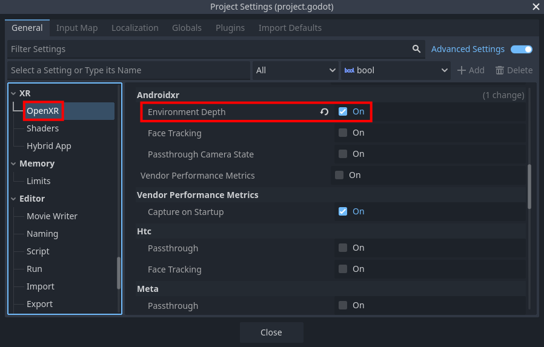

Android XR Environment Depth
============================

The Android XR Environment Depth provides realtime depth information from the player's environment.

Project Settings
----------------

To use Android XR Environment Depth, the OpenXR extension must be enabled in project settings. The
extension setting can be found in **Project Settings** under the **OpenXR** section. The
**Environment Depth** setting should be listed under **Extensions** in the **Androidxr** subcategory.

Starting and stopping
---------------------

Before Android XR Environment Depth can be used, it needs to be started:

.. code::

	if OpenXRAndroidEnvironmentDepthExtensionWrapper.is_environment_depth_supported():
		OpenXRAndroidEnvironmentDepthExtensionWrapper.start_environment_depth()

This will only work if there is an active OpenXR session. You can connect to the
``OpenXRInterface.session_begun`` signal to run code right when the session starts.

There is a performance cost to using Android XR Environment Depth, so you should only start it when
needed, and stop it when no longer needed. For example, if your application has both a VR and AR mode,
you should make sure that Android XR Environment Depth is only running in AR mode.

.. code::

	if OpenXRAndroidEnvironmentDepthExtensionWrapper.is_environment_depth_started():
		OpenXRAndroidEnvironmentDepthExtensionWrapper.stop_environment_depth()

Smooth data
-----------

Data is provided in two varieties: raw (the default) and smooth.

The smooth data has been processed in order to:

1. Remove the user's hands, and
2. Smooth the depth transitions

To enable smooth data:

.. code::

	OpenXRAndroidEnvironmentDepthExtensionWrapper.set_smooth(true)

When using smooth data, since the user's hands have been removed, it's common to also use virtual hand
models animated by hand tracking.

Occlusion
---------

Android XR Environment Depth is most commonly used to enable dynamic occlusion of virtual objects by real
world objects in AR applications.

Normally, the images from the passthrough camera are drawn behind any virtual objects rendered by Godot.
This means that if a real world object moves into a position that should be in front of a virtual object,
the virtual object will still be drawn on top of the real world object. This can easily break immersion.

Using Android XR Environment Depth, you can prevent Godot from drawing pixels where a real world object
would be closer than the given pixel.

.. figure:: img/environment_depth/environment_depth_demo.png
    :align: center

    Example of a blue cube being occluded by a gaming chair.

Using the :ref:`OpenXRAndroidEnvironmentDepth <class_openxrandroidenvironmentdepth>` node
~~~~~~~~~~~~~~~~~~~~~~~~~~~~~~~~~~~~~~~~~~~~~~~~~~~~~~~~~~~~~~~~~~~~~~~~~~~~~~~~~~~~~~~~~

The easiest way to enable occlusion is by adding an
:ref:`OpenXRAndroidEnvironmentDepth <class_openxrandroidenvironmentdepth>` node as a child of your
**XRCamera3D** node.

This node takes the depth map from Android XR Environment Depth and reprojects it into the depth buffer used by
Godot's renderer, so that any virtual pixels that are behind real-world objects will automatically be discard.

However, the depth map has a relatively low resolution, its accuracy decreases further away from the
player, and some precision is lost in the reprojection.

To work around this issue, you can adjust the
:ref:`reprojection_offset_exponent <class_openxrandroidenvironmentdepth_property_reprojection_offset_exponent>` and
:ref:`reprojection_offset_scale <class_openxrandroidenvironmentdepth_property_reprojection_offset_scale>`
properties, which will offset the depth information to be somewhat closer the player. How much closer is a function
of the distance from the camera.

You can think of the offset as being calculated by this formula:

.. code::

	var offset = pow(z_distance_from_camera, reprojection_offset_exponent) * reprojection_offset_scale

If you want certain objects to not be occluded, set the ``render_priority`` on their materials to a value lower than
:ref:`OpenXRAndroidEnvironmentDepth.render_priority <class_openxrandroidenvironmentdepth_property_render_priority>`,
so that they're rendered before this node fills the depth buffer.

.. note::

	All transparent objects are always rendered after all opaque objects, so there is no
	``render_priority`` value that can cause a transparent object to be rendered before this node.

If that isn't flexible enough for your needs, you can write your own shaders that directly use the
environment depth data.

Using a custom shader
~~~~~~~~~~~~~~~~~~~~~

The environment depth map is directly available to Godot shaders, using the following global shader uniforms:

.. table::
   :widths: auto

   +-----------------------------------------------------+--------------------+--------------------------------------------------------------------------------------------------------+
   | ``ANDROID_ENVIRONMENT_DEPTH_AVAILABLE``             | ``bool``           | Will be ``true`` if Android XR Environment Depth data is available.                                    |
   +-----------------------------------------------------+--------------------+--------------------------------------------------------------------------------------------------------+
   | ``ANDROID_ENVIRONMENT_DEPTH_TEXTURE``               | ``sampler2DArray`` | The environment depth map texture captured by the depth sensor.                                        |
   +-----------------------------------------------------+--------------------+--------------------------------------------------------------------------------------------------------+
   | ``ANDROID_ENVIRONMENT_DEPTH_RESOLUTION``            | ``int``            | The size of both dimensions of the depth map.                                                          |
   +-----------------------------------------------------+--------------------+--------------------------------------------------------------------------------------------------------+
   | ``ANDROID_ENVIRONMENT_DEPTH_TANFOV_LEFT``           | ``vec4``           | The [code]tan()[/code] of the FOV angles of the depth sensor in this order: left, right, down, and up. |
   +-----------------------------------------------------+--------------------+--------------------------------------------------------------------------------------------------------+
   | ``ANDROID_ENVIRONMENT_DEPTH_TANFOV_RIGHT``          | ``vec4``           | The [code]tan()[/code] of the FOV angles of the depth sensor in this order: left, right, down, and up. |
   +-----------------------------------------------------+--------------------+--------------------------------------------------------------------------------------------------------+
   | ``ANDROID_ENVIRONMENT_DEPTH_CAMERA_TO_WORLD_LEFT``  | ``mat4``           | Transform matrix from the NDC space of the depth sensor to world space, for the left eye.              |
   +-----------------------------------------------------+--------------------+--------------------------------------------------------------------------------------------------------+
   | ``ANDROID_ENVIRONMENT_DEPTH_CAMERA_TO_WORLD_RIGHT`` | ``mat4``           | Transform matrix from the NDC space of the depth sensor to world space, for the right eye              |
   +-----------------------------------------------------+--------------------+--------------------------------------------------------------------------------------------------------+

Using a custom shader will have slightly better precision than using ``OpenXRAndroidEnvironmentDepth``,
because we aren't reprojecting into the coordinate space of Godot's camera.

It could also take advantage of ``ALPHA`` to smooth out the edges, rather than having a hard cutoff.
