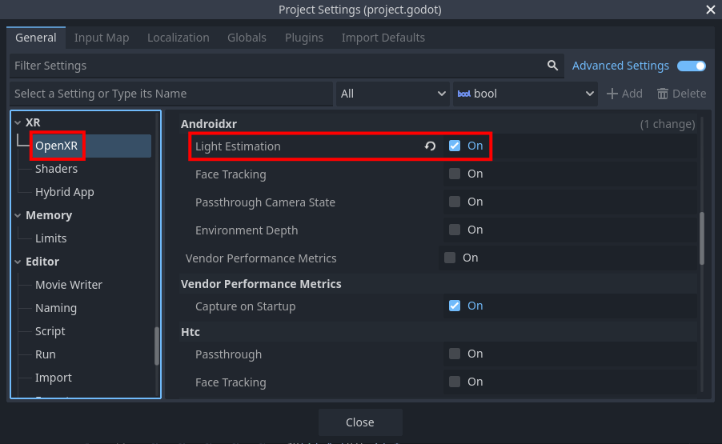
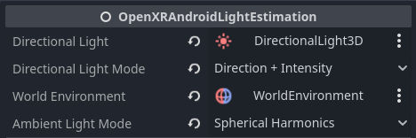

Android XR Light Estimation
===========================

The Android XR Light Estimation extension provides real time lighting
information from the player's environment.

This can allow virtual objects to be rendered with lighting that more
realistically matches the real world environment that they are being
placed in.

There are two ways to use Android XR Light Estimation:

1. The :ref:`OpenXRAndroidLightEstimation <class_openxrandroidlightestimation>`
   node, which can automatically update ``DirectionalLight3D`` and
   ``WorldEnvironment`` nodes in your scene. Or,
2. Passing data from the :ref:`OpenXRAndroidLightEstimationExtensionWrapper <class_openxrandroidlightestimationextensionwrapper>`
   singleton to custom shaders.

.. note::

    Check out the `Android XR Light Estimation Sample Project <https://github.com/GodotVR/godot_openxr_vendors/tree/master/samples/androidxr-light-estimation-sample>`_
    for a working demo that shows both approaches.

Project Settings
----------------

To use Android XR Light Estimation, the OpenXR extension must be
enabled in project settings. The extension setting can be found in
**Project Settings** under the **OpenXR** section. The **Light Estimation**
setting should be listed under **Extensions** in the **Androidxr**
subcategory.

Starting and stopping
---------------------

Before Android XR Light Estimation can be used, it needs to be started:

.. code::

	if OpenXRAndroidLightEstimationExtensionWrapper.is_light_estimation_supported():
		OpenXRAndroidLightEstimationExtensionWrapper.start_light_estimation()

This will only work if there is an active OpenXR session. You can connect
to the ``OpenXRInterface.session_begun`` signal to run code right when
the session starts.

There is a performance cost to using Android XR Light Estimation, so
you should only start it when needed, and stop it when no longer needed.
For example, if your application has both a VR and AR mode, you should
make sure that Android XR Light Estimation is only running in AR mode.

Permissions
-----------

Light Estimation requires the ``android.permission.SCENE_UNDERSTANDING_COARSE``
permission, which will automatically be requested when your application
starts up if Android XR Light Estimation is enabled, as well as the
**Automatically Request Runtime Permissions** setting.

If the user hasn't granted this permission previously, they will be
shown a prompt, asking them to allow scene understanding.
However, Light Estimation won't actually work until after they've granted
the permission, so you may want connect to the
``SceneTree.on_request_permission_result`` signal, for example:

.. code::

	func _ready() -> void:
		get_tree().on_request_permissions_result.connect(_on_request_permissions_result)

	func _on_request_permissions_result(p_permission: String, p_granted: bool) -> void:
		if p_permission == "android.permission.SCENE_UNDERSTANDING_COARSE" and p_granted:
			# Retry starting light estimation...
			pass

Using the :ref:`OpenXRAndroidLightEstimation <class_openxrandroidlightestimation>` node
---------------------------------------------------------------------------------------

The easiest way to use Android XR Light Estimation is by adding an
:ref:`OpenXRAndroidLightEstimation <class_openxrandroidlightestimation>` node
to your scene, and updating the **Directional Light** and/or **World Environment**
properties to point to your ``DirectionalLight3D`` and/or ``WorldEnvironment`` nodes,
respectively.

This way you don't need to make any changes to the materials or shaders used
in your project - the light estimation data will be incorporated automatically.

If **Directional Light** is set, then the **Directional Light Mode** will
determine how the ``DirectionalLight3D`` is updated:

- **Disabled**: The directional light won't be updated at all. This is useful for
  temporarily disabling light estimation's effect on the light.
- **Direction Only**: Only update the direction of the directional light.
- **Direction + Intensity**: Update the direction and intensity of the directional
  light.
- **Direction + Color + Intensity**: Update the direction, color, and intensity of
  the directional light.

If **World Environment** is set, then the **Ambient Light Mode** will
determine how the ``WorldEnvironment`` is updated:

- **Disabled**: The world environment won't be updated at all. This is useful for
  temporarily disabling light estimation's effect on the world environment.
- **Color**: Only update the environment's ambient color.
- **Spherical Harmonics**: Use spherical harmonics from the light estimation data
  to update the environment's radiance map.

Using a custom shader
---------------------

If the way that the ``OpenXRAndroidLightEstimation`` node incorporates the light estimation
data isn't to your liking, you can get the data yourself and pass it to custom shaders.

There are a few different types of data that can be provided, so first you'll need to update the
:ref:`OpenXRAndroidLightEstimationExtensionWrapper.light_estimate_types<class_openxrandroidlightestimationextensionwrapper_property_light_estimate_types>`
property with the types that you need.

For example:

.. code::

	OpenXRAndroidLightEstimationExtensionWrapper.light_estimate_types = \
		OpenXRAndroidLightEstimationExtensionWrapper.LIGHT_ESTIMATE_TYPE_DIRECTIONAL_LIGHT | \
		OpenXRAndroidLightEstimationExtensionWrapper.LIGHT_ESTIMATE_TYPE_SPHERICAL_HARMONICS_TOTAL

Then, every frame, you can update the data, see if it's changed since the previous frame,
and then update your shader's parameters:

.. code::

	var last_material_update := 0

	func _process(_delta: float) -> void:
		var ale = OpenXRAndroidLightEstimationExtensionWrapper
		if ale.is_light_estimation_started():
			var next_update = ale.get_last_updated_time()
			if next_update > last_material_update and ale.is_spherical_harmonics_total_valid():
				last_material_update = next_update

				var coefficients = ale.get_spherical_harmonics_total_coefficients()
				# Note: You may want to process the coefficients - see the sample project for an example.

				# Update shader parameters on my custom material.
				CUSTOM_AMBIENT_MATERIAL.set_shader_parameter("coefficients", coefficients)
				CUSTOM_AMBIENT_MATERIAL.set_shader_parameter("rotation", XRServer.world_origin.basis)

Each of the types of data has its own "valid method" that should be called
before accessing that data. For example, in the code snippet above, we called
:ref:`is_spherical_harmonics_total_valid()<class_openxrandroidlightestimationextensionwrapper_method_is_spherical_harmonics_total_valid>`
before calling
:ref:`get_spherical_harmonics_total_coefficients()<class_openxrandroidlightestimationextensionwrapper_method_get_spherical_harmonics_total_coefficients>`.

Take a look at the `sample project <https://github.com/GodotVR/godot_openxr_vendors/tree/master/samples/androidxr-light-estimation-sample>`_
for a complete example of using a custom shader for ambient lighting.
