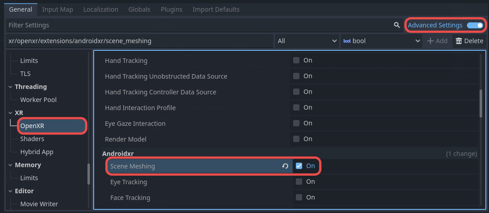

Android XR Scene Meshing
========================

.. note::

    Check out the `Android XR Scene Meshing Sample Project <https://github.com/GodotVR/godot_openxr_vendors/tree/master/samples/androidxr-scenemeshing-sample>`_
    for a working demo of Android XR Scene Meshing.

The Android XR Scene Meshing extension provides realtime mesh data that is meant to approximate the objects in a user's physical environment.

Project Settings
----------------

To use Scene Meshing, it must be enabled in project settings.
The setting can be found in **Project Settings** under the **OpenXR** section.
The **Scene Meshing** setting should be listed under **Extensions** in the **Androidxr** subcategory.
**Advanced Settings** must be enabled for the setting to be visible.

Requesting Permissions
-----------------------

Using Scene Meshing requires the ``android.permission.SCENE_UNDERSTANDING_FINE`` permission. Before requesting permissions, check to see if the permission
is already granted using `OS.get_granted_permissions() <https://docs.godotengine.org/en/stable/classes/class_os.html#class-os-method-get-granted-permissions>`_.
If it's not granted, request the permission with `OS.request_permissions() <https://docs.godotengine.org/en/stable/classes/class_os.html#class-os-method-request-permissions>`_.
See the `Android XR Scene Meshing Sample Project <https://github.com/GodotVR/godot_openxr_vendors/tree/master/samples/androidxr-scenemeshing-sample>`_ for example code.

Initialize Scene Meshing
------------------------

Once the needed permission is granted, Scene Meshing can be accessed with the :ref:`OpenXRAndroidSceneMeshing <class_openxrandroidscenemeshing>` object.
Create a new instance of this object and call the :ref:`initialize <class_openxrandroidscenemeshing_method_initialize>` method.
You can check if a semantic label set is supported with :ref:`get_supported_semantic_label_sets <class_openxrandroidscenemeshingextension_method_get_supported_semantic_label_sets>`.
:ref:`SEMANTIC_LABEL_SET_NONE <class_openxrandroidscenemeshing_constant_semantic_label_set_none>` is always supported.

.. code-block:: gdscript

    var scene_meshing_ext = Engine.get_singleton("OpenXRAndroidSceneMeshingExtension")
    var supported_semantic_label_sets = scene_meshing_ext.get_supported_semantic_label_sets()

    var semantic_label_set = OpenXRAndroidSceneMeshing.SEMANTIC_LABEL_SET_NONE
    if supported_semantic_label_sets.has(OpenXRAndroidSceneMeshing.SEMANTIC_LABEL_SET_DEFAULT):
        semantic_label_set = OpenXRAndroidSceneMeshing.SEMANTIC_LABEL_SET_DEFAULT

    var scene_meshing = OpenXRAndroidSceneMeshing.new()
    if not scene_meshing.initialize(semantic_label_set, true):
        printerr("Failed to initialize OpenXRAndroidSceneMeshing")

Using Submesh Data
------------------

To retrieve mesh data, call the :ref:`get_submesh_data <class_openxrandroidscenemeshing_method_get_submesh_data>` method.
This method accepts a ``Transform3D`` and ``Vector3`` that defines the bounding box position, orientation, and extents for the requested data;
and will return a ``Dictionary`` with ``StringName`` UUID keys pointing to their corresponding :ref:`OpenXRAndroidSceneSubmeshData <class_openxrandroidscenesubmeshdata>` objects.

In the below example we derive the bounding box from the position of the scene's ``XRCamera3D``, getting the submesh data
for a one meter cubic area with its center located one meter in front of the camera's position.

.. code-block:: gdscript

    var query_bounds_pose = get_tree().root.get_camera_3d().get_camera_transform().translated_local(Vector3.FORWARD)
    var query_bounds_extents = Vector3.ONE
    var submesh_datas = scene_meshing.get_submesh_data(query_bounds_pose, query_bounds_extents)

With this dictionary of submesh data, you can now iterate over all returned entries and respond to its :ref:`UpdateState <enum_openxrandroidscenesubmeshdata_updatestate>`.

.. code-block:: gdscript

    for uuid in submesh_datas.keys():
        var submesh_data = submesh_datas[uuid]
        var update_state = submesh_data.get_update_state()

For example, if the returned state is ``UPDATE_STATE_CREATED``, you might create a new ``MeshInstance3D`` using the submesh data
with :ref:`get_transform <class_openxrandroidscenesubmeshdata_method_get_transform>`
and :ref:`get_arrays <class_openxrandroidscenesubmeshdata_method_get_arrays>` like so:

.. code-block:: gdscript

    var array_mesh = ArrayMesh.new()
    array_mesh.add_surface_from_arrays(Mesh.PRIMITIVE_TRIANGLES, submesh_data.get_arrays())
    var mesh_instance = MeshInstance3D.new()
    mesh_instance.transform = submesh_data.get_transform()
    mesh_instance = array_mesh

For more example code on using submesh data, see the `Android XR Scene Meshing Sample Project <https://github.com/GodotVR/godot_openxr_vendors/tree/master/samples/androidxr-scenemeshing-sample>`_.
