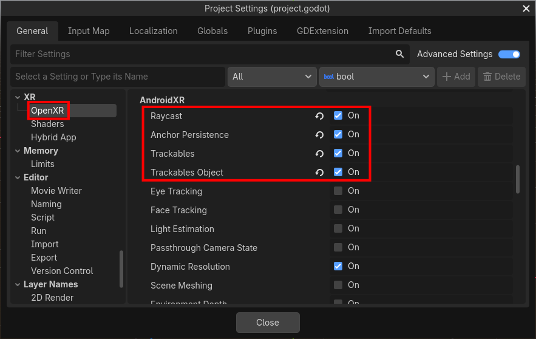

Android XR Trackables
=====================

Trackables can provide information about the physical space the player is in.

.. note::

    Android XR Trackables shouldn't be confused with
    `OpenXR Spatial Entities <https://docs.godotengine.org/en/latest/tutorials/xr/openxr_spatial_entities.html>`_,
    which provide similar functionality and are also supported on Android XR.

    OpenXR Spatial Entities are the new system, which will eventually replace Android XR Trackables.
    But, at the moment, there are still features in Android XR Trackables that aren't present in OpenXR Spatial Entities.

    If you don't need any of those features, we highly recommend using OpenXR Spatial Entities instead.

Project Settings
----------------

To use Android XR Trackables, you'll have to enable one or more of its features.

Open up **Project Settings** and navigate to the **OpenXR** section. In the **AndroidXR** subcategory,
there are four checkboxes:

- **Trackables:** This must be enabled to use any Android XR Trackables feature. On its own it provides
  plane detection (walls, floor, and other flat surfaces).
- **Trackables Object:** Detects a mouse, keyboard or laptop. A common use-case is to provide a "cut out"
  so the player can see the real objects through the virtual scene.
- **Raycast:** Allows casting rays into the physical environment and getting a collision point.
- **Anchor Persistence:** Allows placing persistent anchors that will remain in a physical location,
  even after the app has been quit and launched again later.

Permissions
-----------

Trackables requires the ``android.permission.SCENE_UNDERSTANDING_COARSE``
permission, which will automatically be requested when your application
starts up if Android XR Trackables is enabled and the
**Automatically Request Runtime Permissions** project setting is on.

If the user hasn't granted this permission previously, they will be
shown a prompt, asking them to allow scene understanding.
However, Trackables won't actually work until after they've granted
the permission, so you may want to connect to the
``SceneTree.on_request_permissions_result`` signal, for example:

.. code::

  func _ready() -> void:
    get_tree().on_request_permissions_result.connect(_on_request_permissions_result)

  func _on_request_permissions_result(p_permission: String, p_granted: bool) -> void:
    if p_permission == "android.permission.SCENE_UNDERSTANDING_COARSE" and p_granted:
      # We should now start getting data from Trackables!
      pass

``XRTracker`` and ``XRAnchor3D``
--------------------------------

Similar to OpenXR Spatial Entities, Trackables provides most of its information through the
use of `XRTracker <https://docs.godotengine.org/en/latest/classes/class_xrtracker.html>`_
objects which can be obtained by calling
`XRServer.get_tracker() <https://docs.godotengine.org/en/latest/classes/class_xrserver.html#class-xrserver-method-get-tracker>`_.

Trackables provides three new subclasses of ``XRTracker``:

- :ref:`OpenXRAndroidTrackablePlaneTracker  <class_openxrandroidtrackableplanetracker>`
- :ref:`OpenXRAndroidTrackableObjectTracker <class_openxrandroidtrackableobjecttracker>`
- :ref:`OpenXRAndroidAnchorTracker <class_openxrandroidanchortracker>`

Each subclass provides unique data associated with that type of tracker.

`XRAnchor3D <https://docs.godotengine.org/en/latest/classes/class_xranchor3d.html>`_
is a node which will automatically update its position and orientation to match the ``XRTracker`` that it's
assigned to via its
`tracker <https://docs.godotengine.org/en/latest/classes/class_xrnode3d.html#class-xrnode3d-property-tracker>`_
property.

A very common pattern is to:

1. Connect to the
   `XRServer.tracker_added <https://docs.godotengine.org/en/latest/classes/class_xrserver.html#class-xrserver-signal-tracker-added>`_
   and
   `XRServer.tracker_removed <https://docs.godotengine.org/en/latest/classes/class_xrserver.html#class-xrserver-signal-tracker-removed>`_
   signals.

2. Look up the ``XRTracker`` for each new tracker that's added.

3. Create a new ``XRAnchor3D`` for that tracker and add it as a child of the ``XROrigin3D``.

4. Check the subclass of the ``XRTracker``, and use that information to add child nodes to the ``XRAnchor3D``,
   which will be automatically kept at the correct location.

5. Remove the ``XRAnchor3D`` when the tracker is removed.

Plane Detection
---------------

Using the ``XRTracker`` and ``XRAnchor3D`` pattern described above, you can visualize
each plane via code like:

.. code::

  const PlaneVisualScene = preload("res://plane_visual.tscn")

  @onready var xr_origin: XROrigin3D = $XROrigin3D

  var _visuals: Dictionary

  func _ready():
    XRServer.tracker_added.connect(_on_tracker_added)
    XRServer.tracker_removed.connect(_on_tracker_removed)

  func _on_tracker_added(tracker_name: StringName, _type: int):
    var tracker: XRTracker = XRServer.get_tracker(tracker_name)
    if not tracker is OpenXRAndroidTrackablePlaneTracker:
      return

    var anchor_node := XRAnchor3D.new()
    anchor_node.tracker = tracker_name
    xr_origin.add_child(anchor_node)

    # Create a custom scene to visually represent the plane, using some of the data
    # from the tracker.
    var plane_visual = PlaneVisualScene.instantiate()
    plane_visual.setup_plane_visual(tracker.get_extents(), tracker.get_plane_type(), tracker.get_plane_label())
    anchor_node.add_child(plane_visual)

    _visuals[tracker_name] = plane_visual

  func _on_tracker_removed(tracker_name: StringName, _type: int):
    if not _visuals.has(tracker_name):
      return

    _visuals[tracker_name].queue_free()
    _visuals.erase(tracker_name)

Object Detection
----------------

Similarly, using object detection can be done by simply checking for ``OpenXRAndroidTrackableObjectTracker``
objects and using their data.

.. code::

  func _on_tracker_added(tracker_name: StringName, _type: int):
    var tracker: XRTracker = XRServer.get_tracker(tracker_name)
    if not tracker is OpenXRAndroidTrackableObjectTracker:
      return

    # [...]

    # Create a custom scene to visually represent the object, using some of the data
    # from the tracker.
    var object_visual = ObjectVisualScene.instantiate()
    object_visual.setup_object_visual(tracker.get_extents(), tracker.get_object_label())
    anchor_node.add_child(object_visual)

    # [...]

Persistent Anchors
------------------

Persistent Anchors work a bit differently, because they are originally created by the application,
not simply detected in the world. You create them at runtime (to anchor a virtual object in the real
world, for example), and they will be restored after the app has been quit and launched again.

You should still use the ``XRServer.tracker_added`` and ``XRServer.tracker_removed`` signals to trigger
creating and removing ``XRAnchor3D`` nodes to hold the visuals. When persistent anchors are restored
after the application restarts, you'll be notified via ``XRServer.tracker_added``, just like
detected trackables.

To create and persist an anchor initially you can do:

.. code::

  # A new anchor can be attached to another trackable (like a plane).
  # Or, if null, then the anchor won't be attached to anything.
  var attached_to_trackable: OpenXRAndroidTrackableTracker = null

  # The anchor's transform is relative to the current XROrigin3D node.
  var anchor_transform := Transform3D()

  # This creates the new anchor, but its full position may not be available yet.
  var anchor_tracker := OpenXRAndroidTrackablesExtension.create_anchor_tracker(anchor_transform, attached_to_trackable)

  # Attempt to persist the anchor.
  if not OpenXRAndroidDeviceAnchorPersistenceExtension.persist_anchor_tracker(anchor_tracker):
    push_error("Failed to persist anchor!")
    return

  # Get the anchor's UUID, so that it can be associated with something meaningful in the game.
  # This will need to be saved in the game's save data, because all that will be automatically
  # restored is the UUID, not what it's supposed to represent.
  var anchor_uuid := anchor_tracker.get_persist_uuid()

When you no longer need an anchor, you can unpersist and delete it:

.. code::

  anchor_tracker.unpersist()

  OpenXRAndroidTrackablesExtension.destroy_anchor_tracker(anchor_tracker)

Ray Casting
-----------

Using ``OpenXRAndroidRaycastExtension`` you can cast rays into the real world, and detect collisions
against detected planes or against the data from the headset's depth sensor.

.. code::

  var trackable_types := [
    OpenXRAndroidRaycastExtension.TRACKABLE_TYPE_PLANE,
    OpenXRAndroidRaycastExtension.TRACKABLE_TYPE_DEPTH,
  ]

  var ray_origin := Vector3.ZERO
  var ray_direction := Vector3.FORWARD
  var max_results := 10

  var results: Array[OpenXRAndroidHitResult] = OpenXRAndroidRaycastExtension.raycast(trackable_types, ray_origin, ray_direction, max_results)

  for hit in results:
    var tracker := hit.get_tracker()

    if tracker and tracker is OpenXRAndroidTrackablePlaneTracker:
      # We hit a plane, represented by this tracker.
      pass

    # The hit gives both position and orientation, with its local Z axis pointing towards the ray origin.
    var hit_pose: Transform3D = hit.get_pose()

Doing a ray cast against depth can be a very slow operation, so doing it every frame is not recommended.

Sample
------

Check out the
`Android XR Trackables Sample <https://github.com/GodotVR/godot_openxr_vendors/tree/master/samples/androidxr-trackables-sample>`_
for a full working demo.
