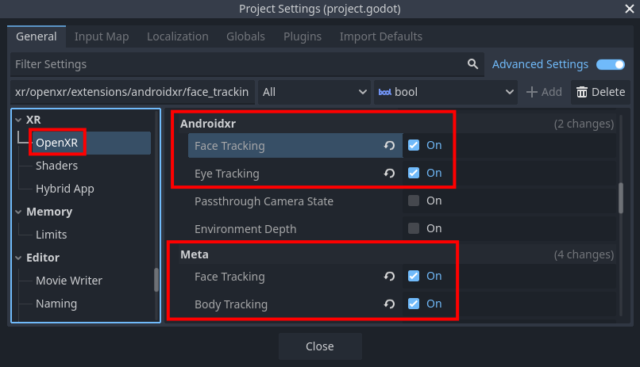
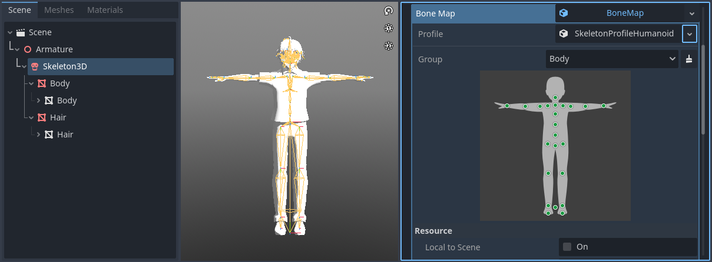
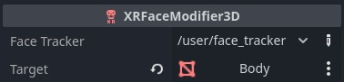

Body and Face Tracking
======================

.. note::

    Check out the `Body Tracking Sample Project <https://github.com/GodotVR/godot_openxr_vendors/tree/master/samples/body-tracking-sample>`_
    for a working demo of some Meta and Android XR body and face tracking features.

The Godot OpenXR Vendors plugin supports a number of OpenXR extensions related to body and face tracking
from both Meta and Android XR.
This document will walk through the provided features and how to use them.

Project Settings
----------------

To use body tracking, the vendor-specific body tracking extensions must be enabled in project settings,
under the **OpenXR** section:

- Meta supports extensions for **Body Tracking** and **Face Tracking**, which can be found in the
  **Meta** subcategory.
- Android XR supports extensions for **Face Tracking** and **Eye Tracking**, which can be found in
  the **Android XR** subcategory.

Body Tracking Setup
-------------------

Body tracking features require a rigged mesh that can be retargeted to the
`Godot Humanoid <https://docs.godotengine.org/en/stable/classes/class_skeletonprofilehumanoid.html>`_ layout.
See the Godot documentation on `Retargeting 3D Skeletons <https://docs.godotengine.org/en/stable/tutorials/assets_pipeline/retargeting_3d_skeletons.html>`_
for more info.

    A skeleton being retargeted to the Godot Humanoid profile in the model's import settings

After you have a properly imported skeleton, you can apply body tracking to it with the
`XRBodyModifier3D <https://docs.godotengine.org/en/stable/classes/class_xrbodymodifier3d.html>`_ node.
Add this node as a child of the model's `Skeleton3D <https://docs.godotengine.org/en/latest/classes/class_skeleton3d.html>`_.

.. image:: img/body_tracking/body_tracking_body_modifier_node_tree.png

The ``XRBodyModifier3D`` node's ``body_update`` property lets you indicate which areas of
the skeleton you'd like to apply tracking data to: upper body, lower body, and hands.
The ``bone_update`` property specifies how this data is applied: full (rotation and position),
or rotation only.

.. note::
    While hand tracking may be used as a part of body tracking, the hand tracking extension
    must be enabled to do this. See the documentation on :doc:`meta/hand_tracking` for more info.

Face Tracking Setup
-------------------

Face tracking features require a mesh with blend shapes that are compatible with the
`Unified Expressions <https://docs.vrcft.io/docs/tutorial-avatars/tutorial-avatars-extras/unified-blendshapes>`_
standard, ARKit, or SRanipal.

After adding the mesh to your scene, you can apply face tracking to it with the
`XRFaceModifier3D <https://docs.godotengine.org/en/latest/classes/class_xrfacemodifier3d.html>`_ node.
You can add this node anywhere in your scene.

Set the ``target`` property to the mesh with the blend shapes:

Additional Meta Extensions
--------------------------

Lower Body Tracking
~~~~~~~~~~~~~~~~~~~

The basic Meta OpenXR body tracking extension ``XR_FB_body_tracking`` only provides data
for upper body tracking. The extension ``XR_META_body_tracking_full_body``, if supported,
is what provides the lower body data. When supported by the runtime, this requires no further
setup. You can check if ``XR_META_body_tracking_full_body`` is supported by calling
:ref:`is_full_body_tracking_supported() <class_openxrfbbodytrackingextension_method_is_full_body_tracking_supported>`.

Manual Height Override
~~~~~~~~~~~~~~~~~~~~~~

When using body tracking, automatic calibration of a user's height will take place.
Should you wish to override this, first check to see if the runtime supports the ``XR_META_body_tracking_calibration``
extension with :ref:`is_body_tracking_height_override_supported() <class_openxrfbbodytrackingextension_method_is_body_tracking_height_override_supported>`.
If supported, you may suggest an override value within the range of 0.5 and 3.0 meters to
:ref:`suggest_body_tracking_height_override() <class_openxrfbbodytrackingextension_method_suggest_body_tracking_height_override>`.
The runtime then may adjust the returned body tracking data to be scaled to this height.

Body Tracking Fidelity
~~~~~~~~~~~~~~~~~~~~~~

The ``XR_META_body_tracking_fidelity`` extension allows users to request that body tracking
data be collected with either a low or high level of fidelity. Check if this extension is supported with
:ref:`is_body_tracking_fidelity_supported() <class_openxrfbbodytrackingextension_method_is_body_tracking_fidelity_supported>`.
If supported, you can request your desired fidelity level using
:ref:`request_body_tracking_fidelity() <class_openxrfbbodytrackingextension_method_request_body_tracking_fidelity>`.
By default, a high level of fidelity is used for body tracking, but low fidelity may be used to
save CPU resources at the cost of lower body tracking precision.

Additional Android XR Extensions
--------------------------------

Eye Tracking
~~~~~~~~~~~~

Godot has support for the
`Eye Gaze Interaction <https://docs.godotengine.org/en/latest/tutorials/xr/openxr_settings.html#eye-gaze-interaction>`_ extension,
which provides a single gaze pose that is filtered and stabilized for use with user interface
interactions.
However, this may not be the best fit for all use cases, for example, controlling avatar eyes in a
social multiplayer application.

The ``XR_ANDROID_eye_tracking`` extension provides two eye poses (one for each eye) and can track
when the user blinks.

Similar to Eye Gaze Interaction, you can use it by adding a pair of new ``XRController3D`` nodes to
your ``XROrigin3D`` node, and set their ``tracker`` properties to:

- ``/user/eye_tracker_android/left``
- ``/user/eye_tracker_android/right``

You can check if the ``blink`` "button" has been pressed on either ``XRController3D`` node to detect
if the user is blinking with that eye.
