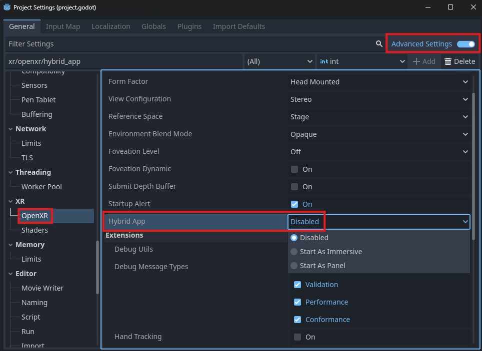

Hybrid Apps
===========

.. note::

    Check out the `Hybrid App Sample Project <https://github.com/GodotVR/godot_openxr_vendors/tree/master/samples/hybrid-app-sample>`_
    for a working demo of hybird app functionality.

Hybrid apps are applications capable of swapping between an immersive 3D mode and a 2D panel mode at runtime.

Project Settings
----------------

To make a hybrid app, the feature must be enabled in your project settings. The setting can be found in **Project Settings** under the **XR** -> **Hybrid App** section.

By default, hybrid app functionality is disabled. Check the **Enabled** box and set the starting mode of the hybrid app with the **Launch Mode** setting.

Switching Modes
---------------

To switch between immersive and panel app modes in your hybrid app, use the :ref:`switch_mode <class_openxrhybridapp_method_switch_mode>` function.
Switching modes restarts the application, so if you want it to start from where the user left off, you will need to use the second argument
to pass data to the new mode as a ``String``, which can be accessed via the :ref:`get_launch_data <class_openxrhybridapp_method_get_launch_data>` function.

Storing the data you'd like to share in a `Dictionary <https://docs.godotengine.org/en/stable/classes/class_dictionary.html>`_
and converting it to/from `JSON <https://docs.godotengine.org/en/stable/classes/class_json.html>`_ is one way you might utilize this feature.
Here's what it might look like if your app is switching from immersive to panel mode and you have a ``current_score`` value you'd like to pass along:

.. code-block:: gdscript

    var current_score = 100 # Game state we want to keep in the new mode.

    var my_dictionary = {}
    my_dictionary["current_score"] = current_score

    var my_string = JSON.stringify(my_dictionary)
    OpenXRHybridApp.switch_mode(OpenXRHybridApp.HYBRID_MODE_PANEL, my_string)

Then, in your newly launched panel application, you could access ``current_score`` like so:

.. code-block:: gdscript

    var my_string = OpenXRHybridApp.get_launch_data()
    var my_dictionary = JSON.parse_string(my_string)
    var current_score = my_dictionary.get("current_score", 0) # Value we wanted to share
