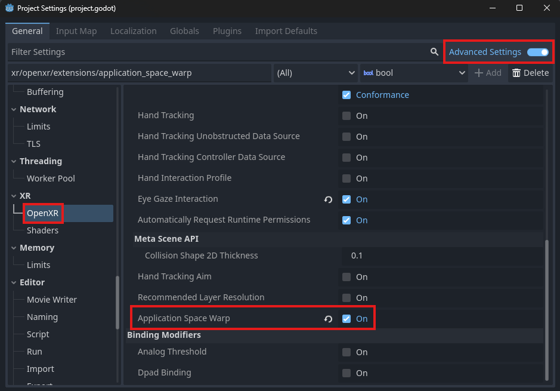

Meta Application Space Warp
===========================

.. note::

    Check out the `Meta Space Warp Sample Project <https://github.com/GodotVR/godot_openxr_vendors/tree/master/samples/meta-space-warp-sample>`_
    for a working demo of Application Space Warp.

Application Space Warp is an extension for Meta and Pico XR devices that allows applications to render at half FPS while the runtime
generates the in-between frames, perserving a smooth experience for users while lowering the workload of the device's CPU/GPU.
This extra GPU power can then be utilized to generate better visuals in your applications.

For more info on how Application Space Warp works, check out Meta's `Introducing Application Space Warp <https://developers.meta.com/horizon/blog/introducing-application-spacewarp/>`_ blog post.

Project Settings
----------------

To use Application Space Warp, the feature must be enabled in your project settings. The setting can be found in **Project Settings** under the **OpenXR** section.
The **Application Space Warp** setting should be listed under **Extensions**. The setting will not display unless **Advanced Settings** are enabled.

