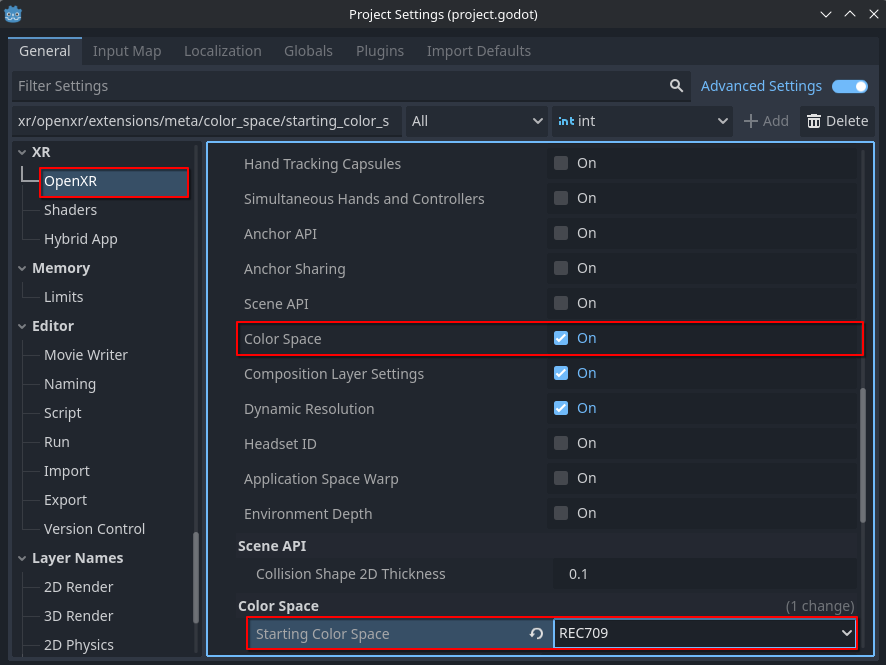

Meta Color Space
================

The Meta Color Space OpenXR extension allows users to specify the color space their XR application renders in.
With this information, the OpenXR runtime may translate the colors provided by the application to the XR device's
native color space, allowing colors to retain their expected look.
Currently, **Godot only supports rendering in Rec. 709 color space**, so it's recommended that developers
use this color space in their applications. When using other color spaces, colors may appear incorrect.

For more information on color spaces, see Meta's documentation on
`Color Management <https://developers.meta.com/horizon/design/display#color-management>`_.

Project Settings
----------------

Meta Color Space is enabled by default. The extension setting can be found in **Project Settings** under the **OpenXR** section.
The **Color Space** setting should be listed under **Extensions** in the **Meta** subcategory.
In the **Color Space** subcategory, the desired **Starting Color Space** may be selected.

