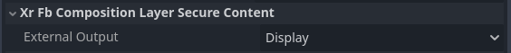
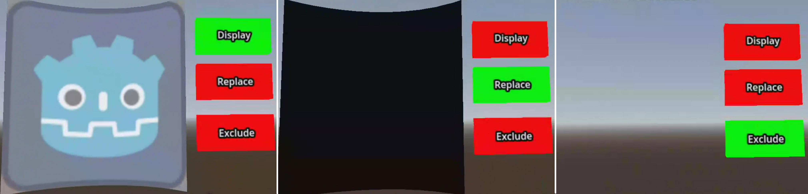
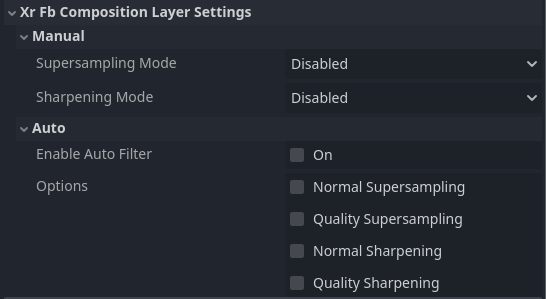
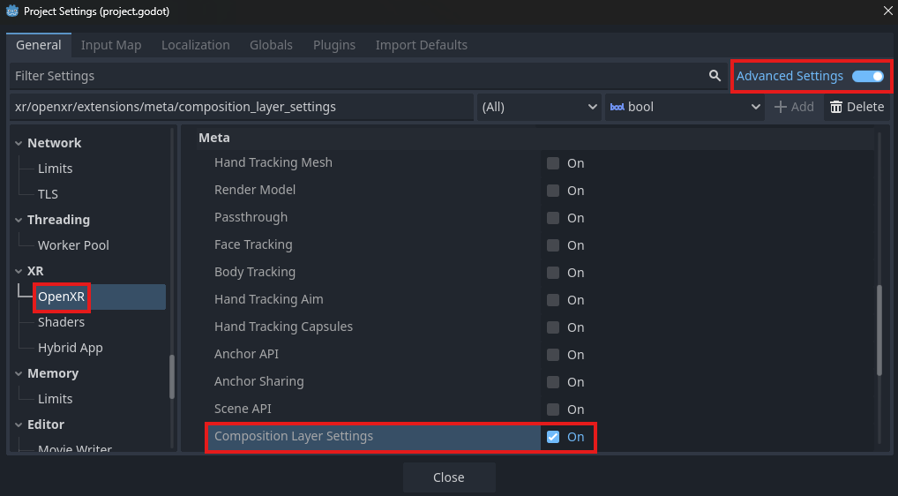
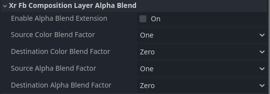
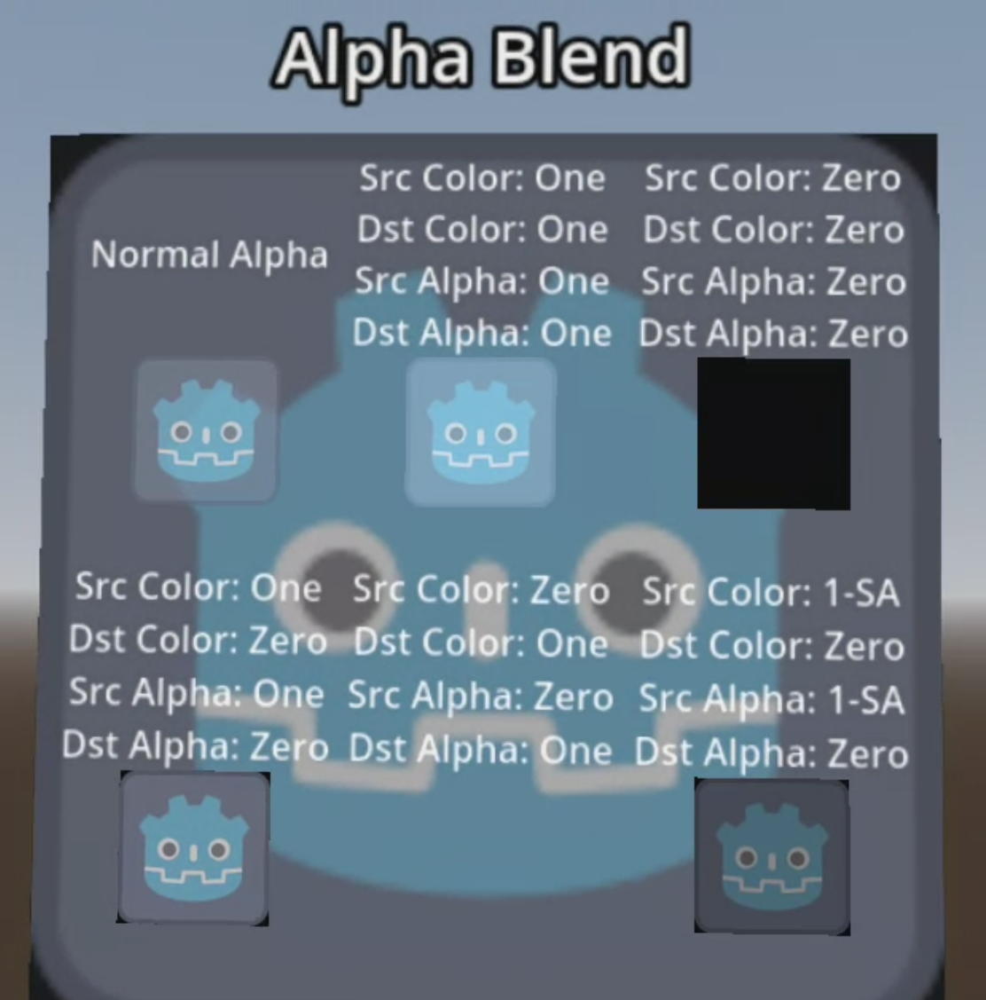

Meta Composition Layers
=======================

.. note::

    Check out the `Meta Composition Layers Sample Project <https://github.com/GodotVR/godot_openxr_vendors/tree/master/samples/meta-composition-layers-sample>`_
    for a working demo of Meta composition layers features.

This tutorial will walk through the Meta-specific OpenXR composition layer extensions that are supported
by the Godot OpenXR Vendors plugin. For a general introduction to OpenXR composition layers in Godot,
check out the `OpenXR Composition Layer Introduction <https://docs.godotengine.org/en/latest/tutorials/xr/openxr_composition_layers.html>`_ tutorial.

The following extensions will expose new properties to the inspector for `OpenXRCompositionLayer <https://docs.godotengine.org/en/latest/classes/class_openxrcompositionlayer.html#class-openxrcompositionlayer>`_ nodes.

Secure Content
--------------

The ``XR_FB_composition_layer_secure_content`` extension allows users to specify how they would like a
composition layer to be rendered to external outputs. This means that this setting will have **no effect**
on the composition layers when viewed from inside the headset, but will take effect when casting to another device.

The following ``external_output`` options are available:

* ``display``: Display the content without any changes to external outputs.
* ``exclude``: Hide this composition layer from external outputs, revealing content behind it.
* ``replace``: Replace the content on this composition layer with a black screen.

    Example of what a composition layer looks like to an external output with the three different output modes.

Filter Settings
---------------

The ``XR_FB_composition_layer_settings`` extension allows users to choose supersampling and sharpening
processing options on a composition layer. The first section of `this Meta article <https://developer.oculus.com/documentation/native/android/mobile-openxr-composition-layer-filtering/>`_
describes what supersampling/sharpening is and why you may want to utilize these processing options; it also provides some screenshots of their effects.

Supersampling and sharpening both have ``normal`` and ``quality`` options. Users are able to set supersampling/sharpening options manually,
or to let the OpenXR runtime toggle between options automatically.

.. note::
    If ``enable_auto_filter`` is set to ``true`` and at least one of the ``options`` flags is selected,
    automatic layer filtering will always take precedence over manual settings.

When automatic layer filtering is enabled, the runtime will only swap between disabled supersampling/sharpening, and the modes indicated by the ``options`` property.

This OpenXR extension is enabled by default, but it can be disabled if desired. In **Project Settings**, navigate to the **OpenXR** section.
The **Composition Layer Settings** setting should be found under **Extensions** in the **Meta** subcategory.
This setting is only visible when **Advanced Settings** are enabled.

Alpha Blend
-----------

The ``XR_FB_composition_layer_alpha_blend`` extension provides improved control over the source and destination blend factors of composition layers,
for both color and alpha. Simply turn on `enable_alpha_blend_extension` and the custom blend factors will take effect.

The ``source_color_blend_factor`` and ``source_alpha_blend_factor`` properties will determine the source contributions to the blending, while
``destination_color_blend_factor`` and ``destination_alpha_blend_factor`` will do the same for the destination. Each of these properties can be set to
:ref:`one of six different blend factors <enum_openxrfbcompositionlayeralphablendextensionwrapper_blendfactor>`.

    Example of different blending results depending on alpha blend settings.
