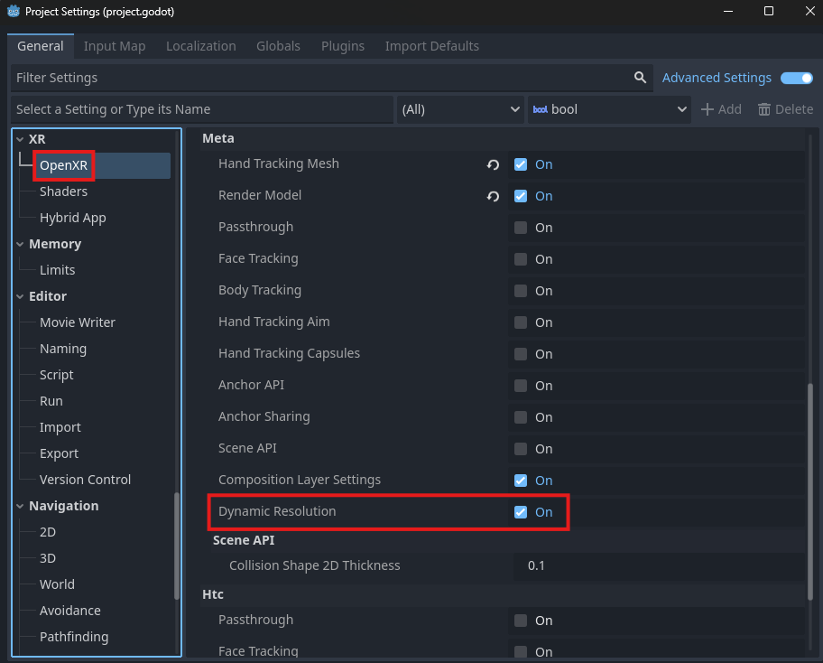

Meta Dynamic Resolution
=======================

The Meta Recommended Layer Resolution OpenXR extension enables the OpenXR runtime to dynamically change the rendered resolution of an application.
If an application has this extension enabled and is struggling with performance, the runtime may lower the resolution to help preserve a smooth user experience.

Project Settings
----------------

Dynamic Resolution is enabled by default. The extension setting can be found in **Project Settings** under the **OpenXR** section.
The **Dynamic Resolution** setting should be listed under **Extensions**.

