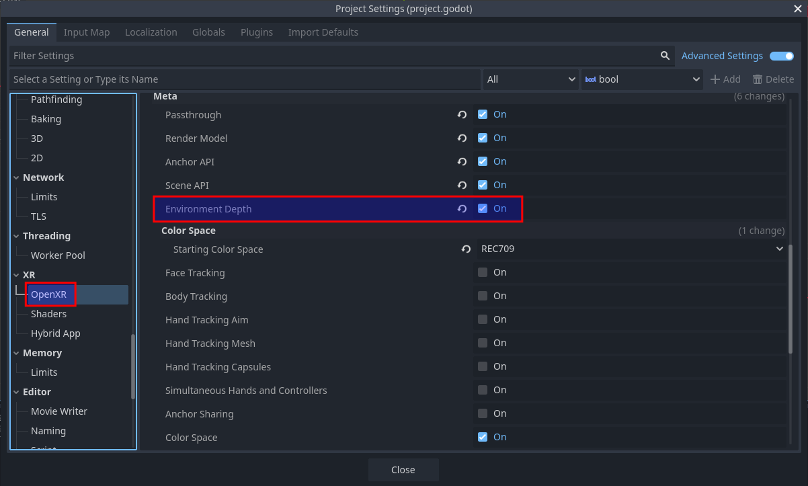

Meta Environment Depth
======================

The Meta Environment Depth extension provides realtime depth information from the player's environment.

This is in contrast to the :ref:`Meta Scene Manager <meta_scene_manager>`, which can provide information about the walls, floors, ceiling, and the furniture in a room, which was captured by the user during the scene capture process.

If a piece of furniture is later moved, the Meta Scene Manager will still report it at its old location, whereas Meta Environment Depth will update immediately.

Project Settings
----------------

To use Meta Environment Depth, the OpenXR extension must be enabled in project settings. The extension setting can be found in **Project Settings** under the **OpenXR** section. The **Environment Depth** setting should be listed under **Extensions** in the **Meta** subcategory.

Starting and stopping
---------------------

Before Meta Environment Depth can be used, it needs to be started:

.. code::

	if OpenXRMetaEnvironmentDepthExtensionWrapper.is_environment_depth_supported():
		OpenXRMetaEnvironmentDepthExtensionWrapper.start_environment_depth()

This will only work if there is an active OpenXR session. You can connect to the ``OpenXRInterface.session_begun`` signal to run code right when the session starts.

There is a performance cost to using Meta Environment Depth, so you should only start it when needed, and stop it when no longer needed. For example, if your application has both a VR and AR mode, you should make sure that Meta Environment Depth is only running in AR mode.

.. code::

	if OpenXRMetaEnvironmentDepthExtensionWrapper.is_environment_depth_started():
		OpenXRMetaEnvironmentDepthExtensionWrapper.stop_environment_depth()

Sometimes it can be useful to omit the player's hands from the depth data:

.. code::

	# This will only take effect if run after environment depth is started.
	OpenXRMetaEnvironmentDepthExtensionWrapper.set_hand_removal_enabled(true)

This is commonly done in combination with virtual hand models animated by hand tracking.

Occlusion
---------

Meta Environment Depth is most commonly used to enable dynamic occlusion of virtual objects by real world objects in AR applications.

Normally, the images from the passthrough camera are drawn behind any virtual objects rendered by Godot. This means that if a real world object moves into a position that should be in front of a virtual object, the virtual object will still be drawn on top of the real world object. This can easily break immersion.

Using Meta Environment Depth, you can prevent Godot from drawing pixels where a real world object would be closer than the given pixel.

.. figure:: img/environment_depth/environment_depth_demo.webp
    :align: center

    Example of a cube being occluded by the player's arms and a physical surface.

Using the :ref:`OpenXRMetaEnvironmentDepth <class_openxrmetaenvironmentdepth>` node
~~~~~~~~~~~~~~~~~~~~~~~~~~~~~~~~~~~~~~~~~~~~~~~~~~~~~~~~~~~~~~~~~~~~~~~~~~~~~~~~~~~

The easiest way to enable occlusion is by adding an :ref:`OpenXRMetaEnvironmentDepth <class_openxrmetaenvironmentdepth>` node as a child of your **XRCamera3D** node.

This node takes the depth map from Meta Environment Depth and reprojects it into the depth buffer used by Godot's renderer, so that any virtual pixels that are behind real-world objects will automatically be discard.

However, due to the relatively low resolution of the depth map, its decreasing accuracy further away from the player, and the precision getting slightly worse from doing reprojection, the depth map may not exactly line up with the data from the Meta Scene Manager. This is especially noticeable if you are using the Meta Scene Manager to draw virtual walls, floors or ceilings - you can sometimes see parts of a virtual wall, for example, getting occluded by the real world wall.

To work around this issue, you can adjust the :ref:`reprojection_offset_exponent <class_openxrmetaenvironmentdepth_property_reprojection_offset_exponent>` and :ref:`reprojection_offset_scale <class_openxrmetaenvironmentdepth_property_reprojection_offset_scale>` properties, which will offset the depth information to be somewhat closer the player. How much closer is a function of the distance from the camera.

You can think of the offset as being calculated by this formula:

.. code::

	var offset = pow(z_distance_from_camera, reprojection_offset_exponent) * reprojection_offset_scale

If you want certain objects to not be occluded, set the ``render_priority`` on their materials to a value lower than :ref:`OpenXRMetaEnvironmentDepth.render_priority <class_openxrmetaenvironmentdepth_property_render_priority>`, so that they're rendered before this node fills the depth buffer.

.. note::

	All transparent objects are always rendered after all opaque objects, so there is no ``render_priority`` value that can cause a transparent object to be rendered before this node.

If that isn't flexible enough for your needs, you can write your own shaders that directly use the environment depth data.

Using a custom shader
~~~~~~~~~~~~~~~~~~~~~

The environment depth map is directly available to Godot shaders, using the following global shader uniforms:

.. table::
   :widths: auto

   +---------------------------------------------------------+--------------------+-------------------------------------------------------------------------------------------------------------+
   | ``META_ENVIRONMENT_DEPTH_AVAILABLE``                    | ``bool``           | Will be ``true`` if Meta Environment Depth data is available.                                               |
   +---------------------------------------------------------+--------------------+-------------------------------------------------------------------------------------------------------------+
   | ``META_ENVIRONMENT_DEPTH_TEXTURE``                      | ``sampler2DArray`` | The environment depth map texture captured by the depth sensor.                                             |
   +---------------------------------------------------------+--------------------+-------------------------------------------------------------------------------------------------------------+
   | ``META_ENVIRONMENT_DEPTH_TEXEL_SIZE``                   | ``vec2``           | The texel size of the environment depth map texture.                                                        |
   +---------------------------------------------------------+--------------------+-------------------------------------------------------------------------------------------------------------+
   | ``META_ENVIRONMENT_DEPTH_PROJECTION_VIEW_LEFT``         | ``mat4``           | The projection view matrix for the left eye of the depth sensor.                                            |
   +---------------------------------------------------------+--------------------+-------------------------------------------------------------------------------------------------------------+
   | ``META_ENVIRONMENT_DEPTH_PROJECTION_VIEW_RIGHT``        | ``mat4``           | The projection view matrix for the right eye of the depth sensor.                                           |
   +---------------------------------------------------------+--------------------+-------------------------------------------------------------------------------------------------------------+
   | ``META_ENVIRONMENT_DEPTH_INV_PROJECTION_VIEW_LEFT``     | ``mat4``           | Inverse of the projection view matrix for the left eye of the depth sensor.                                 |
   +---------------------------------------------------------+--------------------+-------------------------------------------------------------------------------------------------------------+
   | ``META_ENVIRONMENT_DEPTH_INV_PROJECTION_VIEW_RIGHT``    | ``mat4``           | Inverse of the projection view matrix for the right eye of the depth sensor.                                |
   +---------------------------------------------------------+--------------------+-------------------------------------------------------------------------------------------------------------+
   | ``META_ENVIRONMENT_DEPTH_FROM_CAMERA_PROJECTION_LEFT``  | ``mat4``           | Projection matrix from NDC space of Godot's camera to the NDC space of depth sensor, for the left eye.      |
   +---------------------------------------------------------+--------------------+-------------------------------------------------------------------------------------------------------------+
   | ``META_ENVIRONMENT_DEPTH_FROM_CAMERA_PROJECTION_RIGHT`` | ``mat4``           | Projection matrix from NDC space of Godot's camera to the NDC space of depth sensor, for the right eye.     |
   +---------------------------------------------------------+--------------------+-------------------------------------------------------------------------------------------------------------+
   | ``META_ENVIRONMENT_DEPTH_TO_CAMERA_PROJECTION_LEFT``    | ``mat4``           | Projection matrix from NDC space of the depth sensor to the NDC space of Godot's camera, for the left eye.  |
   +---------------------------------------------------------+--------------------+-------------------------------------------------------------------------------------------------------------+
   | ``META_ENVIRONMENT_DEPTH_TO_CAMERA_PROJECTION_RIGHT``   | ``mat4``           | Projection matrix from NDC space of the depth sensor to the NDC space of Godot's camera, for the right eye. |
   +---------------------------------------------------------+--------------------+-------------------------------------------------------------------------------------------------------------+

For example, if you **don't** use an ``OpenXRMetaEnvironmentDepth`` node, you can instead use this shader on a ``MeshInstance3D`` that you want to be occluded by the real world environment:

.. code:: glsl

	shader_type spatial;

	global uniform highp sampler2DArray META_ENVIRONMENT_DEPTH_TEXTURE : filter_nearest, repeat_disable, hint_default_black;
	global uniform highp vec2 META_ENVIRONMENT_DEPTH_TEXEL_SIZE;
	global uniform highp mat4 META_ENVIRONMENT_DEPTH_PROJECTION_VIEW_LEFT;
	global uniform highp mat4 META_ENVIRONMENT_DEPTH_PROJECTION_VIEW_RIGHT;

	uniform vec3 albedo : source_color;

	varying vec4 world_position;

	// 0 = Hard occlusion
	// 1 = Soft occlusion via bilinear filtering
	// 2 = Soft occlusion via PCF 3x3
	#define OCCLUSION_MODE 2

	#define PCF_TEXEL_RADIUS 1.0

	void vertex() {
		world_position = MODEL_MATRIX * vec4(VERTEX, 1.0f);
	}

	float get_bilinear_environment_depth(vec2 uv, uint view_index) {
		vec2 p = uv / META_ENVIRONMENT_DEPTH_TEXEL_SIZE;
		vec2 f = fract(p);
		vec2 i = floor(p);

		vec2 uv00 = (i + vec2(0.5, 0.5)) * META_ENVIRONMENT_DEPTH_TEXEL_SIZE;
		vec2 uv10 = uv00 + vec2(META_ENVIRONMENT_DEPTH_TEXEL_SIZE.x, 0.0);
		vec2 uv01 = uv00 + vec2(0.0, META_ENVIRONMENT_DEPTH_TEXEL_SIZE.y);
		vec2 uv11 = uv00 + META_ENVIRONMENT_DEPTH_TEXEL_SIZE;

		float d00 = texture(META_ENVIRONMENT_DEPTH_TEXTURE, vec3(uv00, float(view_index))).r;
		float d10 = texture(META_ENVIRONMENT_DEPTH_TEXTURE, vec3(uv10, float(view_index))).r;
		float d01 = texture(META_ENVIRONMENT_DEPTH_TEXTURE, vec3(uv01, float(view_index))).r;
		float d11 = texture(META_ENVIRONMENT_DEPTH_TEXTURE, vec3(uv11, float(view_index))).r;

		return mix(mix(d00, d10, f.x), mix(d01, d11, f.x), f.y);
	}

	float get_hard_environment_alpha(vec2 uv, uint view_index, float camera_depth) {
		highp float depth_view_eye_z = texture(META_ENVIRONMENT_DEPTH_TEXTURE, vec3(uv, float(view_index))).r;
		return depth_view_eye_z < camera_depth ? 0.0 : 1.0;
	}

	float smooth_compare(float d, float camera_depth) {
		float delta = d - camera_depth;
		float w = max(fwidth(delta), 1e-5);

		return smoothstep(-w, w, delta);
	}

	float get_smooth_environment_alpha(vec2 uv, uint view_index, float camera_depth) {
		float d = get_bilinear_environment_depth(uv, view_index);
		return smooth_compare(d, camera_depth);
	}

	float get_smooth_pcf3x3_environment_alpha(vec2 uv, uint view_index, float camera_depth) {
		vec2 r = PCF_TEXEL_RADIUS * META_ENVIRONMENT_DEPTH_TEXEL_SIZE;

		float w[3] = float[3](1.0, 2.0, 1.0);
		float norm = 0.0;
		float a = 0.0;

		for (int j = -1; j <= 1; j++) {
			for (int i = -1; i <= 1; i++) {
				float w2 = w[i+1] * w[j+1];
				float d = get_bilinear_environment_depth(uv + vec2(float(i), float(j)) * r, view_index);
				float s = smooth_compare(d, camera_depth);
				a += w2 * s;
				norm += w2;
			}
		}
		return a / norm;
	}

	float calculate_environment_occlusion(vec4 wp, uint view_index) {
		highp vec4 depth_camera_position;
		if (view_index == uint(0)) {
			depth_camera_position = META_ENVIRONMENT_DEPTH_PROJECTION_VIEW_LEFT * wp;
		} else {
			depth_camera_position = META_ENVIRONMENT_DEPTH_PROJECTION_VIEW_RIGHT * wp;
		}

		highp vec2 depth_camera_position_hc = depth_camera_position.xy / depth_camera_position.w;
		depth_camera_position_hc = depth_camera_position_hc * 0.5f + 0.5f;

		highp float camera_depth = depth_camera_position.z / depth_camera_position.w;
		camera_depth = camera_depth * 0.5f + 0.5f;

	#if OCCLUSION_MODE == 1
		return get_smooth_environment_alpha(depth_camera_position_hc, uint(view_index), camera_depth);
	#elif OCCLUSION_MODE == 2
		return get_smooth_pcf3x3_environment_alpha(depth_camera_position_hc, uint(view_index), camera_depth);
	#else
		return get_hard_environment_alpha(depth_camera_position_hc, uint(view_index), camera_depth);
	#endif
	}

	void fragment() {
		ALBEDO = albedo;
		ALPHA = calculate_environment_occlusion(world_position, uint(VIEW_INDEX));
	}

Using a shader like this will have slightly better precision than using ``OpenXRMetaEnvironmentDepth``, because we aren't reprojecting into the coordinate space of Godot's camera.

It can also take advantage of ``ALPHA`` to smooth out the edges, rather than having a hard cutoff.

Accessing the depth map on the CPU
----------------------------------

There are other interesting use cases for the environment depth map aside from occlusion, including some that may involve processing the image on the CPU, for example, doing custom realtime plane tracking.

The depth map from Meta Environment Depth is provided as a GPU resource, so in order to access it on the CPU, we need to download it from the GPU, which we do as an asynchronous operation.

To request the data:

.. code::

	func _ready() -> void:
		# Request the data every 1 second.
		var timer := Timer.new()
		timer.wait_time = 1.0
		time.connect.timeout(_on_timer_timeout)
		add_child(timer)
		timer.start()

	func _on_timer_timeout() -> void:
		OpenXRMetaEnvironmentDepthExtensionWrapper.get_environment_depth_map_async(process_depth_map)

	func process_depth_map(p_data: Array) -> void:
		var data_for_left_eye: Dictionary = p_data[0]

		var image: Image = data_for_left_eye['image']
		var proj_view: Projection = data_for_left_eye['depth_projection_view']
		var inv_proj_view: Projection = data_for_left_eye['depth_inverse_projection_view']

		# Do processing...

It's not recommend to request the depth map every frame, as it's not the most performant operation, but also, the depth map image won't change every frame anyway. The depth sensor captures at lower frame rate than we are rendering to the display, so will only update every few frames.

Also, due to this being an asynchronous operation, the data you receive won't be up-to-date for the current frame - most likely it'll be the data from the previous frame. So, if you need to use the depth map for rendering something on the current frame, it's recommended to do that in a shader instead (as described in the previous section).
