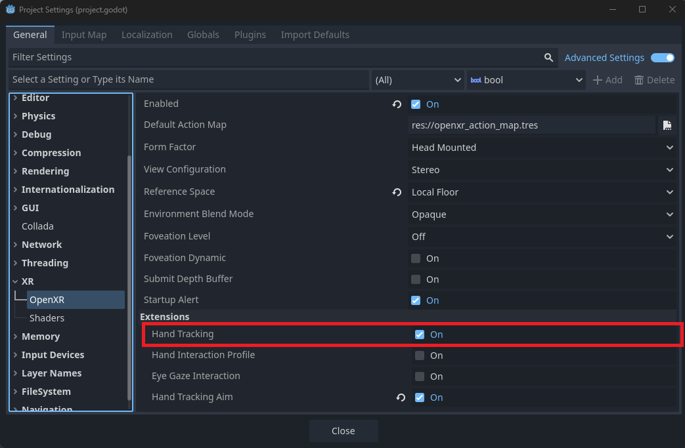
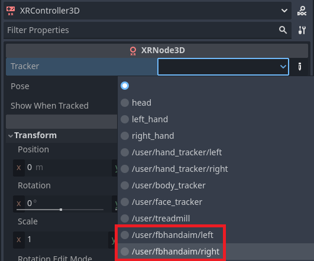

Meta Hand Tracking
==================

.. note::

    Check out the `Meta Hand Tracking Sample Project <https://github.com/GodotVR/godot_openxr_vendors/tree/master/samples/meta-hand-tracking-sample>`_
    for a working demo of Meta-specific hand tracking features.

The Godot OpenXR Vendors plugin supports a number of Meta OpenXR extensions related to hand tracking; this tutorial serves as a tour of
these extensions with an explanation of how they might be used.

To use any of the Meta hand tracking OpenXR extensions, ensure the hand tracking Meta XR feature is enabled in export settings.

The OpenXR hand tracking setting must also be enabled in project settings, this is enabled by default.

Hand Mesh
---------

The ``XR_FB_hand_tracking_mesh`` extension gives access to a skinned hand mesh, making it easy to render a
hand object that is driven by OpenXR hand tracking.

To make the hand mesh follow hand tracking properly, first add an `XRNode3D <https://docs.godotengine.org/en/stable/classes/class_xrnode3d.html>`_
as a child to `XROrigin3D <https://docs.godotengine.org/en/stable/classes/class_xrorigin3d.html>`_. Depending on what
hand you are tracking, set the ``tracker`` property of this node to either ``/user/hand_tracker/left`` or ``/user/hand_tracker/right``.
This node (and its children) will now follow the position of the hand that it is tracking.

Now, add an :ref:`OpenXRFbHandTrackingMesh <class_openxrfbhandtrackingmesh>` node as a child of the ``XRNode3D``.
Set the ``hand`` property of this node in accordance with what hand you would like to track.

Finally, to drive the skeleton movement, add an `XRHandModifier3D <https://docs.godotengine.org/en/latest/classes/class_xrhandmodifier3d.html>`_
node as a child to ``OpenXRFbHandTrackingMesh`` and assign its ``tracker`` property to the hand being tracked.

To easily modify the look of the hand mesh, ``OpenXRFbHandTrackingMesh`` has a ``material`` property that users can assign.

Hand Capsules
-------------

The ``XR_FB_hand_tracking_capsules`` extension provides data that can be used in Godot to construct a number of capsule shapes that resemble a user's hand.
For accessing this data, a number of methods are available on :ref:`OpenXRFbHandTrackingCapsulesExtensionWrapper <class_openxrfbhandtrackingcapsulesextensionwrapper>`.

To use these methods, store the extension singleton in a script variable:

.. code::

    var fb_capsule_ext

    func _ready() -> void:
        fb_capsule_ext = Engine.get_singleton("OpenXRFbHandTrackingCapsulesExtensionWrapper")

If persistent, moving capsule meshes or collision shapes are desired, it is more performant to construct capsules once using ``fb_capsule_ext``
and let the transform of the capsule be driven by a skeleton rather than building capsules and placing them by hand every frame.
The skeleton constructed by :ref:`OpenXRFbHandTrackingMesh <class_openxrfbhandtrackingmesh>` can be used for this purpose.

The :ref:`get_hand_capsule_joint <class_openxrfbhandtrackingcapsulesextensionwrapper_method_get_hand_capsule_joint>` provides the joint ID
that drives the transform of the given capsule. The bone index of the ``OpenXRFbHandTrackingMesh`` bones equates to these joint IDs.
So, if a capsule is child to a `BoneAttachment3D <https://docs.godotengine.org/en/stable/classes/class_boneattachment3d.html>`_ with a matching
``bone_idx``, the capsules will be positioned properly if they are given the correct transform on instatiation.

The capsule positions given by ``OpenXRFbHandTrackingCapsulesExtensionWrapper`` are relative to the position of the ``XROrigin3D``.
To align a capsule's transform with the hand tracked skeleton, you'll have to multiply its transform by the inverse of the associated
hand capsule joint transform. This can be obtained using `XRHandTracker <https://docs.godotengine.org/en/latest/classes/class_xrhandtracker.html>`_.

Here's what putting all of that together might look like in the method of a script:

.. code::

    func hand_capsule_setup(hand_idx: int, hand_tracker: XRHandTracker, skeleton: Skeleton3D) -> void:
        for capsule_idx in fb_capsule_ext.get_hand_capsule_count():
            var capsule_shape := CapsuleShape3D.new()
            capsule_shape.height = fb_capsule_ext.get_hand_capsule_height(hand_idx, capsule_idx)
            capsule_shape.radius = fb_capsule_ext.get_hand_capsule_radius(hand_idx, capsule_idx)

            var capsule_collider := CollisionShape3D.new()
            capsule_collider.shape = capsule_shape

            var capsule_area := Area3D.new()
            capsule_area.add_child(capsule_collider)

            var bone_attachment := BoneAttachment3D.new()
            bone_attachment.bone_idx = fb_capsule_ext.get_hand_capsule_joint(hand_idx, capsule_idx)

            bone_attachment.add_child(capsule_area)
            skeleton.add_child(bone_attachment)

            var capsule_transform: Transform3D = fb_capsule_ext.get_hand_capsule_transform(hand_idx, capsule_idx)
            var bone_transform: Transform3D = hand_tracker.get_hand_joint_transform(bone_attachment.bone_idx)
            capsule_area.transform = bone_transform.inverse() * capsule_transform

For more details on how one might use the hand tracking capsules extension, see the `Hand Tracking Sample Project <https://github.com/GodotVR/godot_openxr_vendors/tree/master/samples/meta-hand-tracking-sample>`_.

Hand Tracking Aim
-----------------

The ``XR_FB_hand_tracking_aim`` extension provides simple gesture recognition, for example, firing a signal when
the user touches their index finger to their thumb. To enable hand tracking aim, open up **Project Settings**, go to **OpenXR**
settings, and enable ``hand_tracking_aim``, which should be listed below **Extensions**.

The hand tracking aim extension uses signals from `XRController3D <https://docs.godotengine.org/en/stable/classes/class_xrcontroller3d.html>`_
to communicate the gesture data. Assigning the ``tracker`` of the ``XRController3D`` to either ``/user/fbhandaim/left``
or ``/user/fbhandaim/right`` will make the node pass along changes in the gesture state for the respective hand.

The ``input_float_changed`` signal will then fire whenever pinch strength value changes are detected for any of the fingers,
these values have a value between ``0.0`` and ``1.0``. The names the signal uses are as follows:

* ``index_pinch_strength``
* ``middle_pinch_strength``
* ``ring_pinch_strength``
* ``little_pinch_strength``

The ``button_pressed`` and ``button_released`` signals will also fire using the following names:

* ``index_pinch``
* ``middle_pinch``
* ``ring_pinch``
* ``little_pinch``
* ``system_gesture``
* ``menu_gesture``
* ``menu_pressed``

In this case, a pinch is considered "pressed" when it is at full strength.
System and menu gestures will be detected when a user turns the palms of their hands to face the HMD.

.. note::
    The menu gesture belongs exclusively to the left hand, and the system gesture to the right.

The ``menu_pressed`` gesture will fire when pressing the menu button, which is done by pinching the index finger
with the menu gesture active. It will only be considered pressed for one frame and immediately release afterward.
No system equivalent to ``menu_pressed`` exists.

