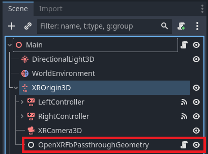

Meta Passthrough
================

.. note::

    Check out the `Meta Passthrough Sample Project <https://github.com/GodotVR/godot_openxr_vendors/tree/master/samples/meta-passthrough-sample>`_
    for a working demo of Meta passthrough features.

If your project requires the user to see their physical environment, you'll need to use the headset's passthrough functionality.
The Godot OpenXR Vendors Plugin provides access to several passthrough modes and filters supported on the Meta Quest, all of which will be broken down in this tutorial.

Project Settings
-----------------

In order to utilize passthrough, you'll have to enable the feature. Open up **Project Settings** and navigate to the **OpenXR** section.
The **Passthrough** setting should be found under **Extensions** in the **Meta** subcategory. This setting is only visible when **Advanced Settings** are enabled.

.. image:: img/passthrough/passthrough_project_setting.png

.. _reconstruction-passthrough:
Reconstruction Passthrough
--------------------------

    Example of unfiltered reconstruction passthrough imagery (Quest Pro)

Reconstruction passthrough will fill the entire background with imagery of the user's surrounding environment, thus "reconstructing" the space outside of the headset.
To enable this passthrough mode, ensure the following:

* The viewport's ``transparent_bg`` property is set to ``true``.
* The environment's ``background_mode`` property is set to ``Environment.BG_COLOR``.
* The environment's ``background_color`` property should have an alpha value of ``0.0``.
* The `OpenXRInterface <https://docs.godotengine.org/en/stable/classes/class_openxrinterface.html>`_'s ``environment_blend_mode`` property is set to ``XRInterface.XR_ENV_BLEND_MODE_ALPHA_BLEND``.

The ``OpenXRInterface`` parent class `XRInterface <https://docs.godotengine.org/en/stable/classes/class_xrinterface.html>`_ has a method ``get_supported_environment_blend_modes()``
that will list ``XRInterface.XR_ENV_BLEND_MODE_ALPHA_BLEND`` if it is supported. To enable reconstruction passthrough, you might add the following to the script attached to the root node of your main scene:

.. code-block:: gdscript

    extends Node3D

    @onready var world_environment: WorldEnvironment = $WorldEnvironment

    func _enable_passthrough(enable: bool) -> void:
        var openxr_interface: OpenXRInterface = XRServer.find_interface("OpenXR")

        # Enable passthrough if true and XR_ENV_BLEND_MODE_ALPHA_BLEND is supported.
        # Otherwise, set environment to non-passthrough settings.
        if enable and openxr_interface.get_supported_environment_blend_modes().has(XRInterface.XR_ENV_BLEND_MODE_ALPHA_BLEND):
            get_viewport().transparent_bg = true
            world_environment.environment.background_mode = Environment.BG_COLOR
            world_environment.environment.background_color = Color(0.0, 0.0, 0.0, 0.0)
            openxr_interface.environment_blend_mode = XRInterface.XR_ENV_BLEND_MODE_ALPHA_BLEND
        else:
            get_viewport().transparent_bg = false
            world_environment.environment.background_mode = Environment.BG_SKY
            openxr_interface.environment_blend_mode = XRInterface.XR_ENV_BLEND_MODE_OPAQUE

Projected Passthrough
---------------------

In this passthrough mode (sometimes referred to as geometry passthrough), passthrough is "projected" onto custom geometry, meaning passthrough imagery will only be visible in certain areas.
You might use this passthrough mode to show only specific objects in a user's physical environment, while rendering the rest in VR.

Enabling projected passthrough only requires the addition of a visible :ref:`OpenXRFbPassthroughGeometry <class_openxrfbpassthroughgeometry>`
node as a child of `XROrigin3D <https://docs.godotengine.org/en/stable/classes/class_xrorigin3d.html>`_. Don't forget to assign the node's ``mesh`` property!

.. note::
    If the ``XRInterface.XR_ENV_BLEND_MODE_ALPHA_BLEND`` blend mode is set and supported on the headset, reconstruction passthrough will always take priority over projected passthrough.

It's important to understand the :ref:`enable_hole_punch <class_openxrfbpassthroughgeometry_property_enable_hole_punch>` property on this node. With this property set to ``true``,
anything Godot renders behind the mesh will be removed from view. If set to ``false``, objects rendered behind the mesh will **still be visible in front of the passthrough**.
By default, ``enable_hole_punch`` is set to ``true``.

    Hole-punched geometry hiding parts of controller models that are rendered behind the meshes.

It's not possible to display hole-punched ``OpenXRFbPassthroughGeometry`` nodes simultaneously with nodes that have hole-punching disabled.
This is because hole-punching requires the viewport's ``transparent_bg`` property to equal ``false``.
If you want your passthrough geometry to have hole-punching disabled, you might use a startup script similar to the one in :ref:`reconstruction-passthrough`
**without** updating the ``environment_blend_mode``.

Passthrough Filters
-------------------

Meta headsets are capable of applying a variety of filters to the passthrough imagery, allowing you to modify the appearance of the user's physical environment.
There are a number of methods in :ref:`OpenXRFbPassthroughExtensionWrapper <class_openxrfbpassthroughextensionwrapper>` that allow you to access these features.
You can call these methods on the ``OpenXRFbPassthroughExtensionWrapper`` singleton, which can be obtained like so:

.. code-block:: gdscript

    var fb_passthrough = Engine.get_singleton("OpenXRFbPassthroughExtensionWrapper")

You can check what :ref:`PassthroughFilter <enum_openxrfbpassthroughextensionwrapper_passthroughfilter>` is enabled by calling :ref:`get_current_passthrough_filter <class_openxrfbpassthroughextensionwrapper_method_get_current_passthrough_filter>`.
By default, the filter mode will be set to ``PASSTHROUGH_FILTER_DISABLED``.

To change the current passthrough filter, you can call one of the following functions:

* :ref:`set_color_map <class_openxrfbpassthroughextensionwrapper_method_set_color_map>`
* :ref:`set_mono_map <class_openxrfbpassthroughextensionwrapper_method_set_mono_map>`
* :ref:`set_brightness_contrast_saturation <class_openxrfbpassthroughextensionwrapper_method_set_brightness_contrast_saturation>`
* :ref:`set_color_lut <class_openxrfbpassthroughextensionwrapper_method_set_color_lut>`
* :ref:`set_interpolated_color_lut <class_openxrfbpassthroughextensionwrapper_method_set_interpolated_color_lut>`

The current passthrough filter can also be updated by calling :ref:`set_passthrough_filter <class_openxrfbpassthroughextensionwrapper_method_set_passthrough_filter>`.
This function will most often be used to **disable** passthrough filters, as calling it with ``PASSTHROUGH_FILTER_DISABLED`` is the only way to return to that filter mode.
Swapping to any other filter mode using this function will require its corresponding setter function in the above list to have been called previously.

Also note that there are two filter properties that can be set regardless of the current filter mode.
These can be set using the functions:

* :ref:`set_edge_color <class_openxrfbpassthroughextensionwrapper_method_set_edge_color>`
* :ref:`set_texture_opacity_factor <class_openxrfbpassthroughextensionwrapper_method_set_texture_opacity_factor>`

    Reconstruction passthrough after setting a red edge color.

.. note::
    Values passed into ``set_edge_color()`` and ``set_texture_opacity_factor()`` will apply to **all filter modes**, even ``PASSTHROUGH_FILTER_DISABLED``.

Color Map Filter
----------------

The :ref:`set_color_map <class_openxrfbpassthroughextensionwrapper_method_set_color_map>` method accepts a `Gradient <https://docs.godotengine.org/en/stable/classes/class_gradient.html>`_
resource and will set the filter mode to :ref:`PASSTHROUGH_FILTER_COLOR_MAP <class_openxrfbpassthroughextensionwrapper_constant_passthrough_filter_color_map>`.
This filter will map the input luminance value of the passthrough imagery to the corresponding RGBA value of the given gradient.

Here's what it might look like in the script and inspector to achieve this:

.. code-block:: gdscript

    @export var color_map: Gradient

    ...

    fb_passthrough.set_color_map(color_map)

Mono Map Filter
---------------

The :ref:`set_mono_map <class_openxrfbpassthroughextensionwrapper_method_set_mono_map>` method accepts a `Curve <https://docs.godotengine.org/en/stable/classes/class_curve.html>`_
resource and will set the filter mode to :ref:`PASSTHROUGH_FILTER_MONO_MAP <class_openxrfbpassthroughextensionwrapper_constant_passthrough_filter_mono_map>`.
This filter will map the input luminance value of the passthrough imagery with the corresponding grayscale value of the given curve.

Here's what it might look like in the script and inspector to achieve this:

.. code-block:: gdscript

    @export var mono_map: Gradient

    ...

    fb_passthrough.set_mono_map(mono_map)

Brightness Contrast Saturation Filter
-------------------------------------

The :ref:`set_brightness_contrast_saturation <class_openxrfbpassthroughextensionwrapper_method_set_brightness_contrast_saturation>` method accepts three ``float`` values
and will set the filter mode to :ref:`PASSTHROUGH_FILTER_BRIGHTNESS_CONTRAST_SATURATION <class_openxrfbpassthroughextensionwrapper_constant_passthrough_filter_brightness_contrast_saturation>`.
This filter will adjust the brightness, contrast, and saturation of the passthrough imagery. The valid ranges of each value are noted in the method description of :ref:`set_brightness_contrast_saturation <class_openxrfbpassthroughextensionwrapper_method_set_brightness_contrast_saturation>`.

Here's what it might look like in the script to achieve this:

.. code-block:: gdscript

    # Optionally allow the values to be edited in the inspector as a Vector3.
    @export var brightness_contrast_saturation: Vector3 = Vector3(10.0, 0.5, 0.5)

    ...

    fb_passthrough.set_brightness_contrast_saturation(brightness_contrast_saturation.x, brightness_contrast_saturation.y, brightness_contrast_saturation.z)

.. _color-lut-filter:
Color LUT Filter
----------------

.. note::
    `This article <https://spark.meta.com/learn/articles/textures-and-materials/color-LUTs/>`_ by Meta provides a good introductory explanation on how to create a color LUT (Look Up Table / Look Up Texture).

The :ref:`set_color_lut <class_openxrfbpassthroughextensionwrapper_method_set_color_lut>` method accepts an :ref:`OpenXRMetaPassthroughColorLut <class_openxrmetapassthroughcolorlut>` resource
along with a ``float`` between ``0.0`` and ``1.0`` that is used to blend linearly between the original passthrough input colors and the mapped color LUT.
This method will set the filter mode to :ref:`PASSTHROUGH_FILTER_COLOR_MAP_LUT <class_openxrfbpassthroughextensionwrapper_constant_passthrough_filter_color_map_lut>`.

    The color LUT used to achieve the above inverted color effect.

To create an ``OpenXRMetaPassthroughColorLut`` resource, you'll have to pass an `Image <https://docs.godotengine.org/en/stable/classes/class_image.html>`_ resource along with a :ref:`ColorLutChannels <enum_openxrmetapassthroughcolorlut_colorlutchannels>` value
into the static ``OpenXRMetaPassthroughColorLut`` :ref:`create_from_image <class_openxrmetapassthroughcolorlut_method_create_from_image>` method, similar to the example below:

.. code-block:: gdscript

    # Assign the color LUT image in the inspector
    @onready var color_lut: Image

    ...

    var meta_color_lut: OpenXRMetaPassthroughColorLut = OpenXRMetaPassthroughColorLut.create_from_image(color_lut, OpenXRMetaPassthroughColorLut.COLOR_LUT_CHANNELS_RGB)

Then, to fully apply the color LUT, we pass in ``meta_color_lut`` with a ``weight`` value of ``1.0`` to the setter function like so:

.. code-block:: gdscript

    fb_passthrough.set_color_lut(1.0, meta_color_lut)

.. note::
    You can check the maximum color LUT resolution supported by the headset at runtime using the :ref:`get_max_color_lut_resolution <class_openxrfbpassthroughextensionwrapper_method_get_max_color_lut_resolution>` method.

Lastly, if you want to smoothly interpolate between two given color LUT ``weight`` values over time, you can use a tween! The following example will interpolate the weight from ``0.0`` to ``1.0`` over a period of two seconds.

.. code-block:: gdscript

    var tween = create_tween()
    tween.tween_method(fb_passthrough.set_color_lut.bind(meta_color_lut), 0.0, 1.0, 2.0)

Interpolated Color LUT Filter
-----------------------------

This filter mode works the same way as the :ref:`color-lut-filter`, only it requires the use of two :ref:`OpenXRMetaPassthroughColorLut <class_openxrmetapassthroughcolorlut>` resources.
The :ref:`set_interpolated_color_lut <class_openxrfbpassthroughextensionwrapper_method_set_interpolated_color_lut>` method will accept those two resources, along with a ``float`` value between ``0.0`` and ``1.0``
that will be used to blend linearly between the two color LUTs. Calling this function will set the filter mode to :ref:`PASSTHROUGH_FILTER_COLOR_MAP_INTERPOLATED_LUT <class_openxrfbpassthroughextensionwrapper_constant_passthrough_filter_color_map_interpolated_lut>`,
which will map the passthrough input to this interpolated color LUT.

The main purpose of this filter mode is to smoothly transition between two distinct color LUTs. Let's assume we have two valid ``OpenXRMetaPassthroughColorLut`` resources named ``meta_color_lut`` and ``meta_color_lut2``.
If ``meta_color_lut`` is fully applied, we can smoothly transition to ``meta_color_lut2`` over a period of two seconds using a tween like so:

.. code-block:: gdscript

    var tween = create_tween()
    tween.tween_method(fb_passthrough.set_interpolated_color_lut.bind(meta_color_lut, meta_color_lut2), 0.0, 1.0, 2.0)
