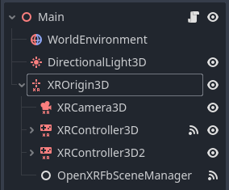
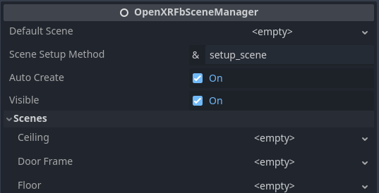
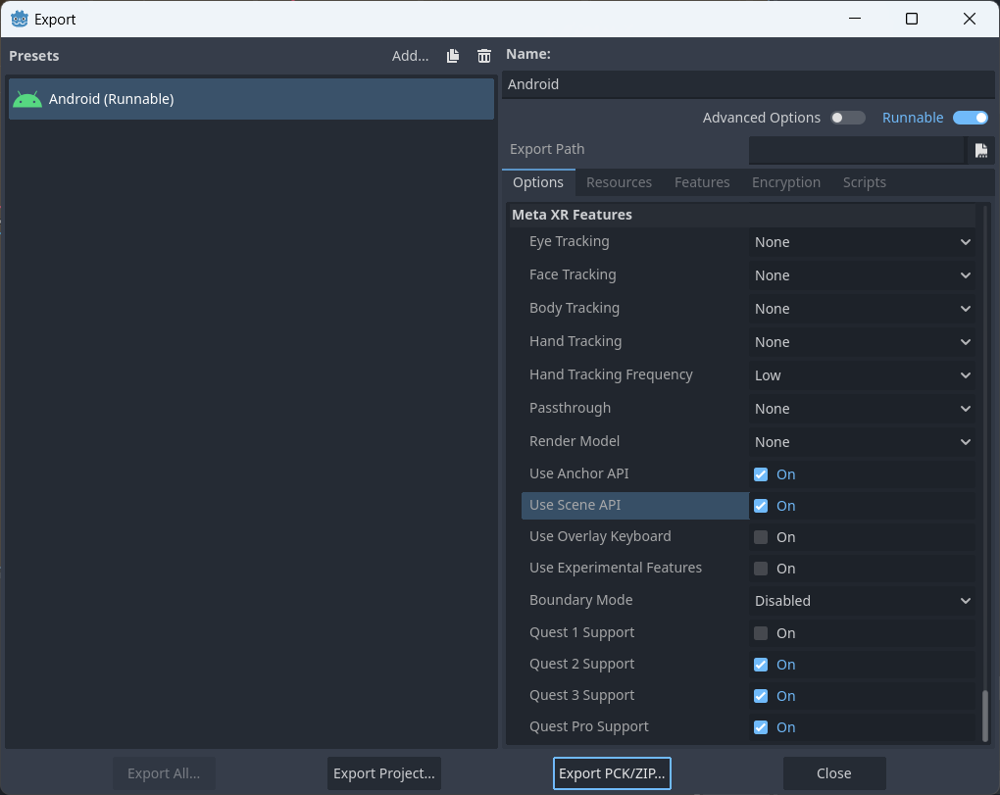
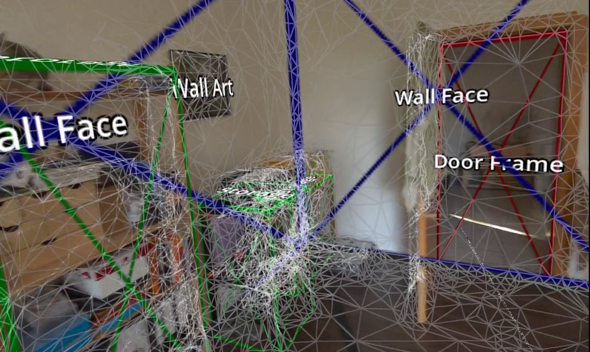
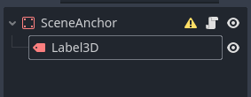
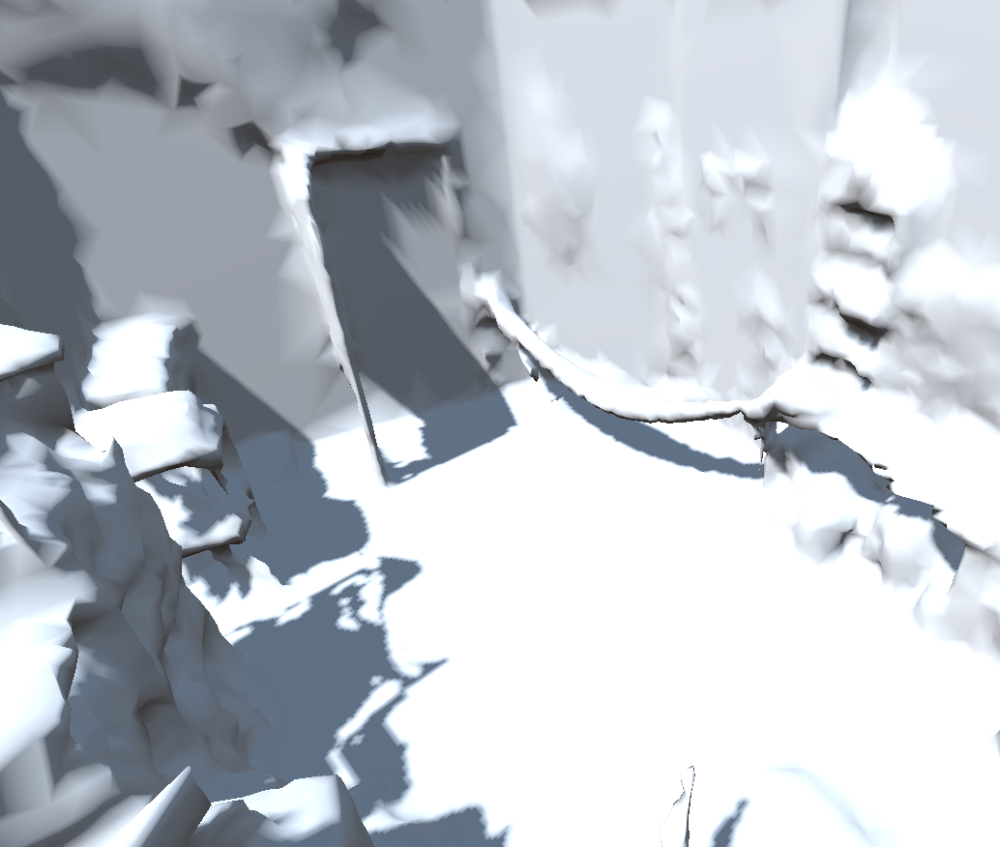
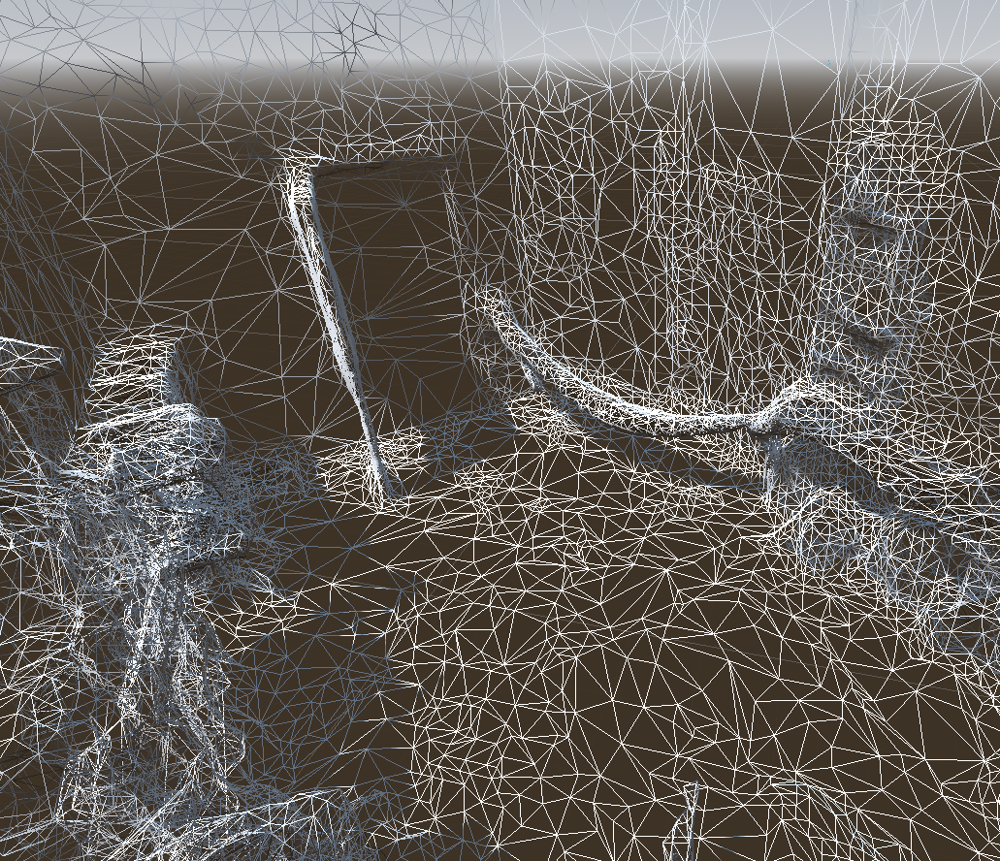

Meta Scene Manager
==================

.. note::

    Meta scene data is frequently used alongside Meta spatial anchors, read the :doc:`spatial_anchors` tutorial for more info.
    Check out the `Meta Scene Sample <https://github.com/GodotVR/godot_openxr_vendors/tree/master/samples/meta-scene-sample>`_
    for a working demo using Meta scene data.

The Scene Manager provides you information about the space you are currently in. This includes the scanned mesh of the room (on Quest 3) as well as things like walls, doors, or tables.
In case you are starting on a new project, please first follow `this guide <https://docs.godotengine.org/en/stable/tutorials/xr/setting_up_xr.html>`_ to set up your project for XR.

Adding the Scene Manager Node
------------------------------

To add the Scene Manager to your project, add the :ref:`OpenXRFbSceneManager <class_openxrfbscenemanager>` as a child node of the XROrigin3D node.

Let's go over the different options of the Scene Manager.
The :ref:`Default Scene <class_openxrfbscenemanager_property_default_scene>` will be instantiated by the Scene Manager for any type of spatial entity (e.g. Walls, Doors, or the Global Mesh) and the ``setup_scene(entity: OpenXRFbSpatialEntity)`` method will be called on the created instance. The name of the method that will be called can be set using the :ref:`Scene Setup Method <class_openxrfbscenemanager_property_scene_setup_method>` property.

The :ref:`Auto Create <class_openxrfbscenemanager_property_auto_create>` option will automatically create any referenced scenes when the OpenXR session starts. Alternatively, the :ref:`create_scene_anchors() <class_openxrfbscenemanager_method_create_scene_anchors>` method can be manually called  to trigger the creation of the scenes.

The **Scenes** section in the options allows you to individually assign a scene to a kind of spatial entity which can help in separating the logic.

Next, head over to the Export Settings and make sure that in the **Meta XR Features** the ``Use Anchor API`` and ``Use Scene API`` options are enabled.

Creating Spatial Entities
-------------------------

Spatial Entities are a collective term for any object that has been mapped by the user in their space. These can be walls, doors, tables, plants, or many other things.

First, create a new scene with the type of ``StaticBody3D`` and add a ``Label3D`` to it. The scene should now look like this:

Next, add a new script with the following content:

.. code-block:: gdscript

    extends StaticBody3D

    @onready var label: Label3D = $Label3D

    func setup_scene(entity: OpenXRFbSpatialEntity) -> void:
        var semantic_labels: PackedStringArray = entity.get_semantic_labels()

        label.text = semantic_labels[0]

        var collision_shape = entity.create_collision_shape()
        if collision_shape:
            add_child(collision_shape)

        var mesh_instance = entity.create_mesh_instance()
        if mesh_instance:
            add_child(mesh_instance)

This script will create a new collision shape and mesh instance for the StaticBody3D using the :ref:`create_collision_shape() <class_openxrfbspatialentity_method_create_collision_shape>` and :ref:`create_mesh_instance() <class_openxrfbspatialentity_method_create_mesh_instance>` methods, respectively. Both functions return a new node that can be added to the scene.
Alternatively, you can use the :ref:`get_triangle_mesh() <class_openxrfbspatialentity_method_get_triangle_mesh>` function to get the mesh data and create your own mesh instance and collision shape.

Additionally, the :ref:`get_semantic_labels() <class_openxrfbspatialentity_method_get_semantic_labels>` function returns a list of labels that are associated with the spatial entity. Normally this list will only contain one label.

Now, add the scene to the Scene Manager by setting the **Default Scene** property or any of the properties in the **Scenes** section to the newly created scene.

Global Mesh
-----------

The Global Mesh is created by the headset when you scan your space with the depth sensor during the scene capture process (currently, Quest 3 only). The Global Mesh can be used for letting physics objects collide with the real world or to occlude virtual objects behind static physical objects.

|global_mesh| |global_mesh_wireframe|

The process of creating the template scene for the global mesh is the same as for any other spatial entity.

Requesting a Scene Capture
--------------------------

In case the space hasn't been set up yet, you can use the :ref:`request_scene_capture() <class_openxrfbscenemanager_method_request_scene_capture>` method to request a scene capture.
The app will be paused and the user will be asked to scan their room.

The :ref:`openxr_fb_scene_capture_completed() <class_openxrfbscenemanager_signal_openxr_fb_scene_capture_completed>` signal can be used to act on the completion of the scene capture.

Additionally, the :ref:`openxr_fb_scene_data_missing() <class_openxrfbscenemanager_signal_openxr_fb_scene_data_missing>` signal is emitted when the space hasn't been set up yet.

The complete code for requesting a scene capture could look like this:

.. code-block:: gdscript

    extends Node

    @onready var scene_manager: OpenXRFbSceneManager = $OpenXRFbSceneManager

    func _ready():
        scene_manager.openxr_fb_scene_data_missing.connect(_scene_data_missing)
        scene_manager.openxr_fb_scene_capture_completed.connect(_scene_capture_completed)

    func _scene_data_missing() -> void:
        scene_manager.request_scene_capture()

    func _scene_capture_completed(success: bool) -> void:
        if success == false:
            return

        # Delete any existing anchors, since the user may have changed them.
        if scene_manager.are_scene_anchors_created():
            scene_manager.remove_scene_anchors()

        # Create scene_anchors for the freshly captured scene
        scene_manager.create_scene_anchors()
