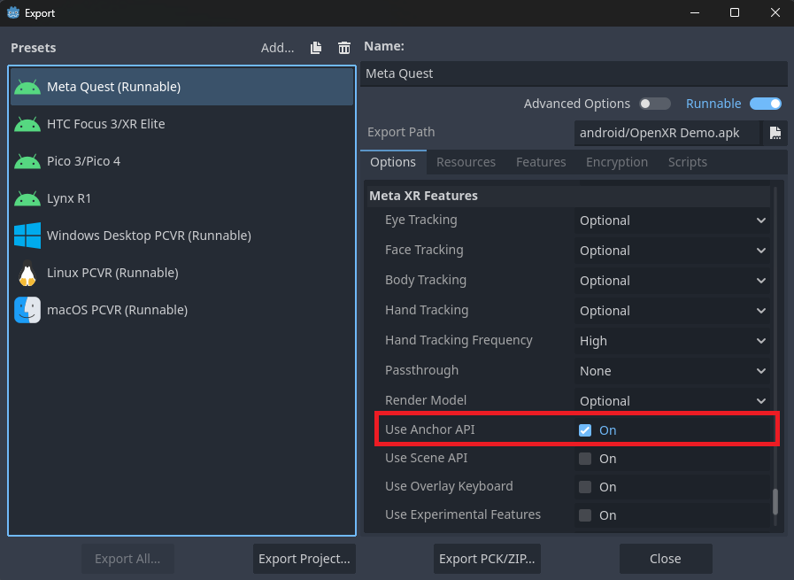
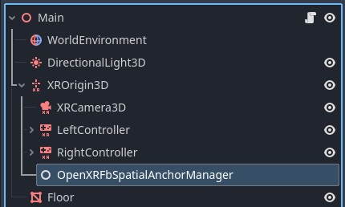
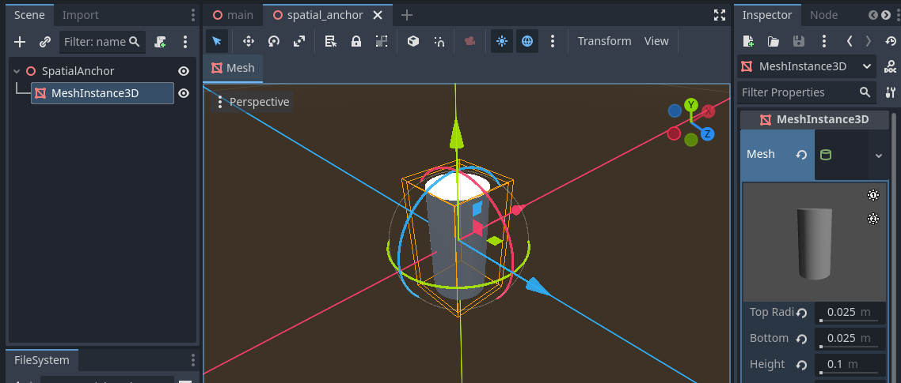
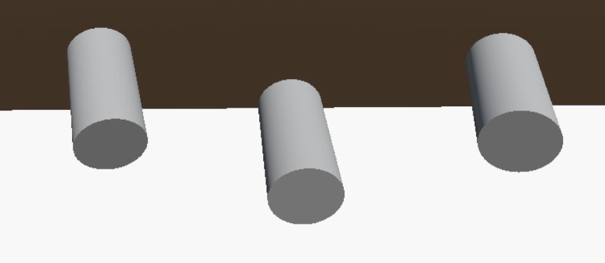
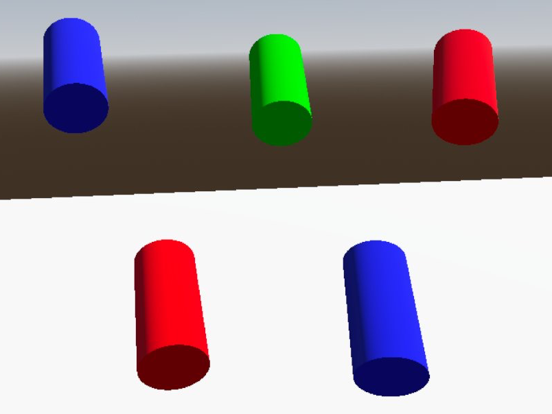

Meta Spatial Anchors
====================

.. note::

    Meta spatial anchors are frequently used alongside Meta scene data, read the :doc:`scene_manager` tutorial for more info.
    Check out the `Meta Scene Sample <https://github.com/GodotVR/godot_openxr_vendors/tree/master/samples/meta-scene-sample>`_
    for a working demo of spatial anchors.

The :ref:`OpenXRFbSpatialAnchorManager <class_openxrfbspatialanchormanager>` node provides an
easy-to-use way to interact with Meta's Spatial Anchors. This tutorial walks through the basic features
of the node such as placing/removing spatial anchors, and saving/loading them to/from a file.
To begin, ensure the ``use_anchor_api`` property in **Export Settings** under **Meta XR Features** is enabled.

Then, add an ``OpenXRFbSpatialAnchorManager`` node as a child of `XROrigin3D <https://docs.godotengine.org/en/stable/classes/class_xrorigin3d.html>`_.

Creating Spatial Anchors
------------------------

To place spatial anchors, the manager node's :ref:`scene <class_openxrfbspatialanchormanager_property_scene>`
property should be set to the desired "spatial anchor scene" to be instantiated.
Let's make a basic scene for our spatial anchors. Create a new scene that inherits from `Node3D <https://docs.godotengine.org/en/stable/classes/class_node3d.html>`_ and name it ``SpatialAnchor``.
Give that node a child `MeshInstance3D <https://docs.godotengine.org/en/stable/classes/class_meshinstance3d.html>`_ and assign the ``mesh`` property to be a ``CylinderMesh`` like below:

Assign ``spatial_annchor.tscn`` to your main scene's ``OpenXRFbSpatialAnchorManager``. Let's spawn a spatial anchor at the position of one of our
`XRController3D <https://docs.godotengine.org/en/stable/classes/class_xrcontroller3d.html>`_ nodes using its ``button_pressed`` signal.
To spawn a spatial anchor, use the manager node's :ref:`create_anchor <class_openxrfbspatialanchormanager_method_create_anchor>` method.

.. code-block:: gdscript

    @onready var xr_controller_3d: XRController3D = $XROrigin3D/XRController3D
    @onready var spatial_anchor_manager: OpenXRFbSpatialAnchorManager = $XROrigin3D/OpenXRFbSpatialAnchorManager

    func _on_xr_controller_3d_button_pressed(name: String) -> void:
        if name == "ax_button":
		    spatial_anchor_manager.create_anchor(xr_controller_3d.transform, {})

Scene Setup Method
------------------

The ``OpenXRFbSpatialAnchorManager`` :ref:`scene_setup_method <class_openxrfbspatialanchormanager_property_scene_setup_method>` property
is the name of the method that will be called on the spatial anchor scene immediately after instantiation. By default this is named ``setup_scene``.
This method should take an :ref:`OpenXRFbSpatialEntity <class_openxrfbspatialentity>` as an argument. Before creating that method,
let's ammend our ``create_anchor`` method call with some custom data to modify the color of each cylinder we spawn.
Store the hex codes of potential colors in an array constant in the script.

.. code-block:: gdscript

    const COLORS = [
        "#FF0000", # Red
        "#00FF00", # Green
        "#0000FF", # Blue
    ]

    func _on_xr_controller_3d_button_pressed(name: String) -> void:
        if name == "ax_button":
            var custom_data: Dictionary
            custom_data.color = COLORS[randi() % COLORS.size()]
            spatial_anchor_manager.create_anchor(xr_controller_3d.transform, custom_data)

Now we can apply that custom data in our spatial anchor scene's ``setup_scene`` method. Attach a script to the root node of ``spatial_anchor.tscn``.

.. code-block:: gdscript

    extends Node3D

    @onready var mesh_instance_3d: MeshInstance3D = $MeshInstance3D

    func setup_scene(spatial_entity: OpenXRFbSpatialEntity) -> void:
        var data := spatial_entity.custom_data
        var color := Color(data.get('color', '#FFFFFF'))

        var material := StandardMaterial3D.new()
        material.albedo_color = color
        mesh_instance_3d.set_surface_override_material(0, material)

Removing Spatial Anchors
------------------------

To remove a spatial anchor scene, use the :ref:`untrack_anchor <class_openxrfbspatialanchormanager_method_untrack_anchor>` method.
This method accepts either an ``OpenXRFbSpatialEntity`` object or its ``uuid`` as an argument. To demonstrate, let's store the ``uuid`` values
of the spatial anchors we create in an array. Connect the ``openxr_fb_spatial_anchor_tracked`` signal from ``OpenXRFbSpatialAnchorManager``
to an ``_on_anchor_tracked`` method:

.. code-block:: gdscript

    var anchor_uuids: Array[StringName] = []

    func _on_anchor_tracked(anchor_node: XRAnchor3D, spatial_entity: OpenXRFbSpatialEntity, is_new: bool) -> void:
        anchor_uuids.push_front(spatial_entity.uuid)

Then, in the function handling our ``XRController3D`` ``button_pressed`` signal, we can add the following code that will
untrack and remove the most recently placed spatial anchor scene.

.. code-block:: gdscript

    func _on_xr_controller_3d_button_pressed(name: String) -> void:

        ...

        elif name == "by_button":
            var uuid = anchor_uuids.pop_front()
            if spatial_anchor_manager.get_anchor_uuids().has(uuid):
                spatial_anchor_manager.untrack_anchor(uuid)

Saving Spatial Anchors
----------------------

The headset can store the positions and UUIDs of the spatial anchors between sessions, but not any custom information about them for your game,
such as the color in our tutorial project. Developers need to save that extra data somewhere, probably together with any other save data used by the project.
In this tutorial, we will store the spatial anchor data in a JSON file.
Create a ``save_spatial_anchors_to_file`` method to handle this, along with a ``SPATIAL_ANCHORS_FILE`` constant with the desired filepath.

.. code-block:: gdscript

    const SPATIAL_ANCHORS_FILE = "user://openxr_fb_spatial_anchors.json"

    func save_spatial_anchors_to_file() -> void:
        var file := FileAccess.open(SPATIAL_ANCHORS_FILE, FileAccess.WRITE)
        if not file:
            print("ERROR: Unable to open file for writing: ", SPATIAL_ANCHORS_FILE)
            return

        var anchor_data: Dictionary
        for uuid in spatial_anchor_manager.get_anchor_uuids():
            var entity: OpenXRFbSpatialEntity = spatial_anchor_manager.get_spatial_entity(uuid)
            anchor_data[uuid] = entity.custom_data

        file.store_string(JSON.stringify(anchor_data))
        file.close()

To keep this file up to date, this save method should be called whenever spatial anchors are created or removed.
This is easily done using the ``openxr_fb_spatial_anchor_tracked`` and ``openxr_fb_spatial_anchor_untracked`` signals from ``OpenXRFbSpatialAnchorManager``.

.. code-block:: gdscript

    func _on_anchor_tracked(anchor_node: XRAnchor3D, spatial_entity: OpenXRFbSpatialEntity, is_new: bool) -> void:
        if is_new:
            save_spatial_anchors_to_file()

    func _on_anchor_untracked(anchor_node: XRAnchor3D, spatial_entity: OpenXRFbSpatialEntity) -> void:
        save_spatial_anchors_to_file()

Loading Spatial Anchors
-----------------------

Now that there is spatial anchor data to be loaded, we can use the ``OpenXRFbSpatialAnchorManager`` :ref:`load_anchors <class_openxrfbspatialanchormanager_method_load_anchors>` method.
The JSON file containing the data will need to be parsed and then passed to ``load_anchors``, so create a ``load_spatial_anchors_from_file`` method to handle this.

.. code-block:: gdscript

    func load_spatial_anchors_from_file() -> void:
        var file := FileAccess.open(SPATIAL_ANCHORS_FILE, FileAccess.READ)
        if not file:
            return

        var json := JSON.new()
        if json.parse(file.get_as_text()) != OK:
            print("ERROR: Unable to parse ", SPATIAL_ANCHORS_FILE)
            return

        if not json.data is Dictionary:
            print("ERROR: ", SPATIAL_ANCHORS_FILE, " contains invalid data")
            return

        var anchor_data: Dictionary = json.data
        if anchor_data.size() > 0:
            spatial_anchor_manager.load_anchors(anchor_data.keys(), anchor_data, OpenXRFbSpatialEntity.STORAGE_LOCAL, true)

This method should be called after the OpenXR session has been initialized. `OpenXRInterface <https://docs.godotengine.org/en/stable/classes/class_openxrinterface.html#class-openxrinterface>`_
has a ``session_begun`` signal that we can use for this like below:

.. code-block:: gdscript

    func _ready():
        var xr_interface: OpenXRInterface = XRServer.find_interface("OpenXR")
        if xr_interface and xr_interface.is_initialized():
            xr_interface.session_begun.connect(_on_openxr_session_begun)

    func _on_openxr_session_begun() -> void:
        load_spatial_anchors_from_file()
