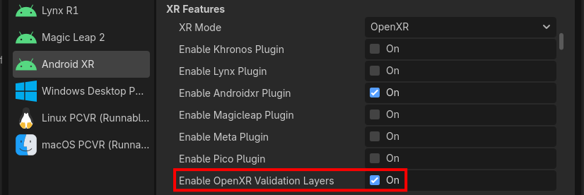

OpenXR Validation Layers for Android
====================================

The Khronos Group provides `validation layers for OpenXR <https://www.khronos.org/blog/new-openxr-validation-layer-helps-developers-build-robustly-portable-xr-applications>`_
that can perform extra validation to ensure that Godot is using OpenXR correctly.

For OpenXR Android projects, the Godot OpenXR Vendors plugin wraps the OpenXR validation layers into
an Android library binary (AAR) to facilitate integration:

* For Godot projects built with the Godot OpenXR Vendors plugin v5, all you need to do is click a checkbox in your export settings!

* Non-Godot Android projects can integrate the OpenXR validation layers Android library by adding the following Gradle dependency:

.. code-block::

    // Grab the latest release.
    implementation("org.godotengine:openxr-validation-layers:+")

.. note::

    The OpenXR validation layers Android library is hosted on `MavenCentral <https://central.sonatype.com/artifact/org.godotengine/openxr-validation-layers/overview>`_
    and updated for every release of the Godot OpenXR vendors plugin.
