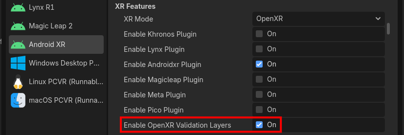

OpenXR Validation Layers for Android
====================================

The Khronos Group provides `validation layers for OpenXR <https://www.khronos.org/blog/new-openxr-validation-layer-helps-developers-build-robustly-portable-xr-applications>`_
that can perform extra validation to ensure that Godot is using OpenXR correctly.

* For Godot Android projects built with the Godot OpenXR Vendors plugin v5 or higher, all you need
to do is click a checkbox in your export settings to integrate the OpenXR validation layers!

* Non-Godot Android projects can integrate the OpenXR validation layers by adding the following
Gradle dependencies:

.. code-block::

    // Grab the latest release.
    implementation("org.khronos.openxr:apilayer_core_validation:+")
    implementation("org.khronos.openxr:apilayer_best_practices_validation:+")

.. note::

    The OpenXR validation layers are hosted on `MavenCentral <https://central.sonatype.com/namespace/org.khronos.openxr>`_.
