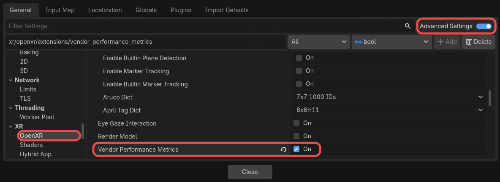
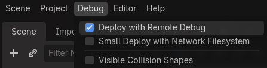
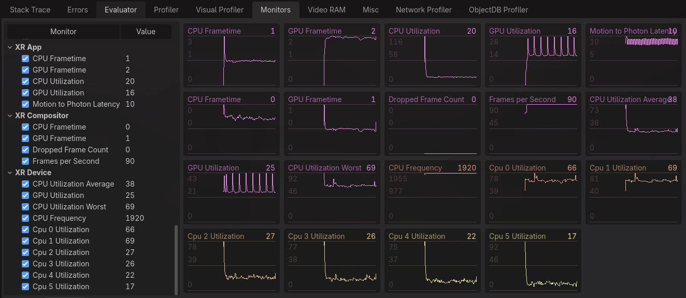

Performance Metrics
===================

.. note::

    Check out the `Performance Metrics Sample Project <https://github.com/GodotVR/godot_openxr_vendors/tree/master/samples/performance-metrics-sample>`_
    for a working demo of performance metrics functionality.

Some OpenXR runtimes implement extensions allowing users to query device and application performance metrics.
Currently, this is supported on **Meta** and **Android XR** devices.

Project Settings
----------------

To enable vendor performance metrics, the feature must be enabled in your project settings.
The extension setting can be found in **Project Settings** under the **OpenXR** section,
the **Vendor Performance Metrics** setting should be listed under **Extensions**.
**Advanced Settings** must be enabled for the setting to be visible.

In the same Extensions section, under **Vendor Performance Metrics**, there is a
**Capture on Startup** setting. This is enabled by default, and will make the runtime automatically
capture performance metrics on startup when the extension is enabled. Capturing may be enabled or
disabled by updating the :ref:`capture_performance_metrics <class_openxrvendorperformancemetrics_property_capture_performance_metrics>` property.

Debug Monitors
--------------

When enabled, vendor performance metrics are visible in Godot's debug monitor display.
This requires **Deploy with Remote Debug** to be enabled under the **Debug** menu.

Upon deploying to your XR device, the extra performance metrics will be available in the
**Debug** panel under the **Monitors** tab.

Manually Querying Metrics
-------------------------

Performance metrics may also be queried manually. This is done by retrieving the available counter paths from the runtime,
and then using the corresponding counter path to get a dictionary of metric info.

.. code-block:: gdscript

    var counter_paths = OpenXRVendorPerformanceMetrics.get_performance_metrics_counter_paths()
    for counter_path in counter_paths:
      var metric: Dictionary = OpenXRVendorPerformanceMetrics.query_performance_metrics_counter(counter_path)

The returned dictionary has the following keys:

* ``counter_path``, the counter path used to query this metric.
* ``counter_flags``, flags indicating the valid value type of the metric.
* ``uint_value``, the unsigned integer value of the metric, only available if :ref:`PERFORMANCE_METRICS_COUNTER_FLAGS_UINT_VALUE_VALID_BIT <class_openxrvendorperformancemetrics_constant_performance_metrics_counter_flags_uint_value_valid_bit>` is set in ``counter_flags``.
* ``float_value``, the float value of the metric, only available if :ref:`PERFORMANCE_METRICS_COUNTER_FLAGS_FLOAT_VALUE_VALID_BIT <class_openxrvendorperformancemetrics_constant_performance_metrics_counter_flags_float_value_valid_bit>` is set in ``counter_flags``.
* ``counter_unit``, the unit type of the metric, which may be useful in formatting. See :ref:`PerformanceMetricsCounterUnit <enum_openxrvendorperformancemetrics_performancemetricscounterunit>` for possible types.

.. note::

    Look at the `Performance Metrics Sample Project <https://github.com/GodotVR/godot_openxr_vendors/tree/master/samples/performance-metrics-sample>`_
    for more example code that manually queries performance metrics.

