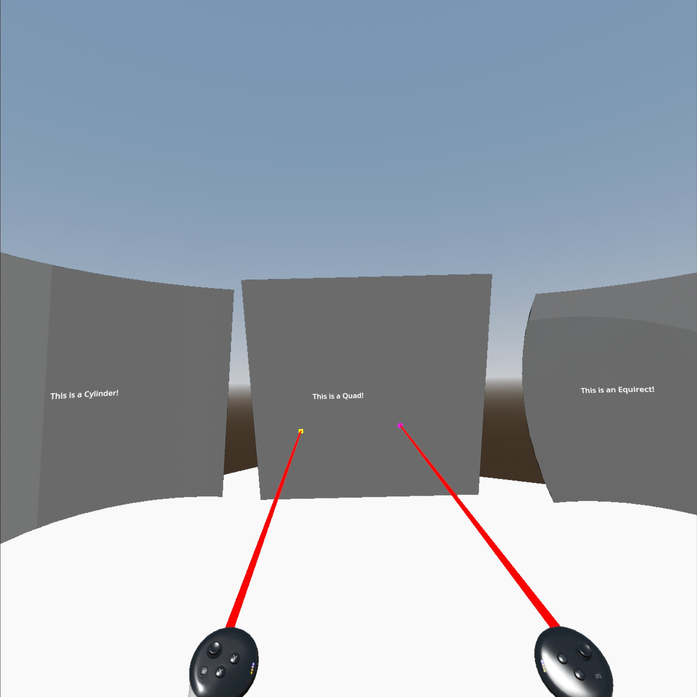
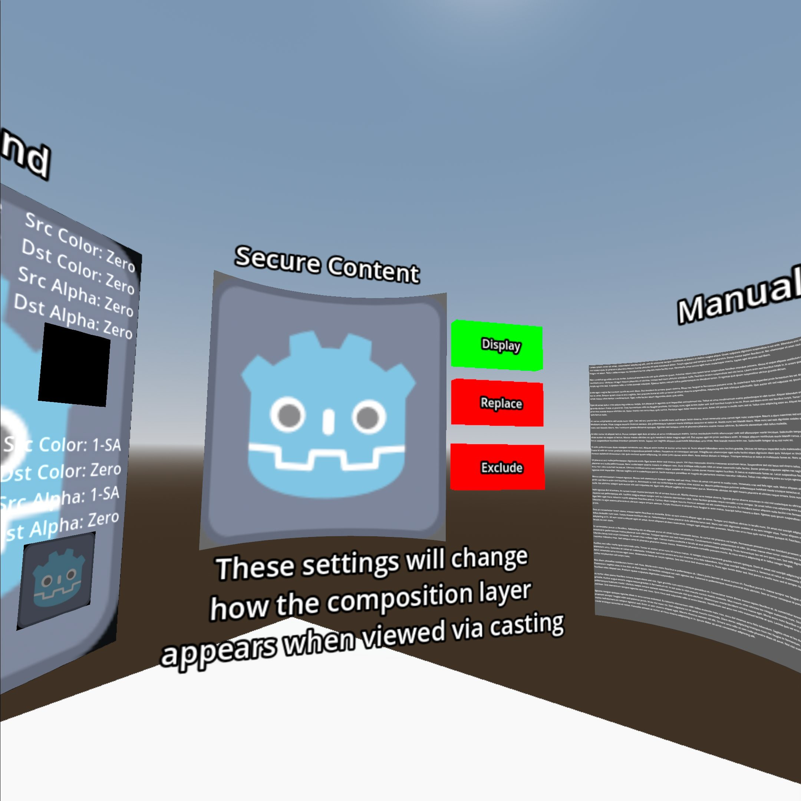

# Meta Composition Layers Sample

> Note: this project requires Godot 4.3 or later

This is a sample project demonstrating the Meta-specific composition layer features supported by the Godot OpenXR Vendors plugin.
See the [Meta Composition Layers](https://godotvr.github.io/godot_openxr_vendors/manual/meta/composition_layers.html)
tutorial doc for a detailed walkthrough on these features.

# Screenshots

