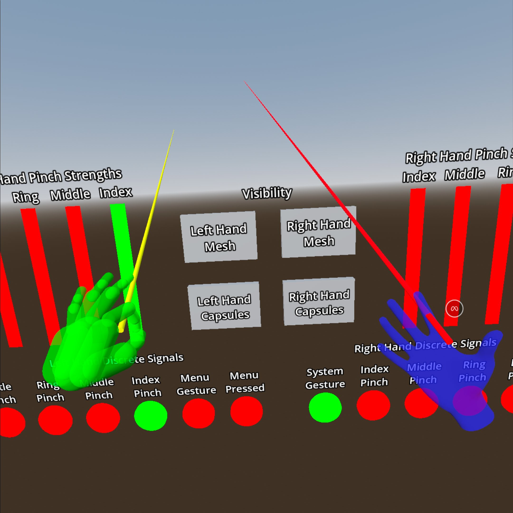

# Meta Hand Tracking Sample

> Note: this project requires Godot 4.3 or later

This is a sample project demonstrating the Meta-specific hand tracking features supported by the Godot OpenXR Vendors plugin.
See the [Meta Hand Tracking](https://godotvr.github.io/godot_openxr_vendors/manual/meta/hand_tracking.html) tutorial doc for
a detailed walkthrough of these features.

# Screenshots

