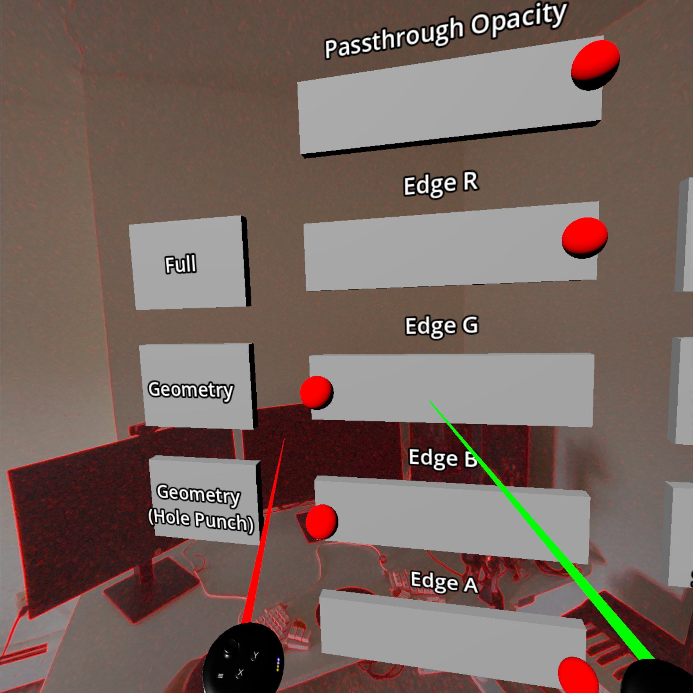
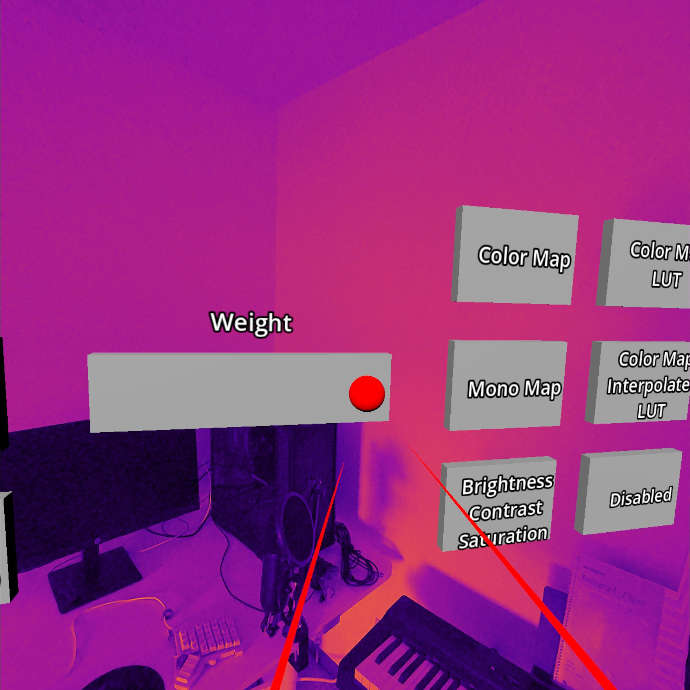

# Meta Passthrough Sample

> Note: this project requires Godot 4.3 or later

This is a sample project demonstrating the Meta-specific passthrough features supported by the Godot OpenXR Vendors plugin.
See the [Meta Passthrough](https://godotvr.github.io/godot_openxr_vendors/manual/meta/passthrough.html) tutorial doc for
a detailed walkthrough of these features.

# Screenshots

