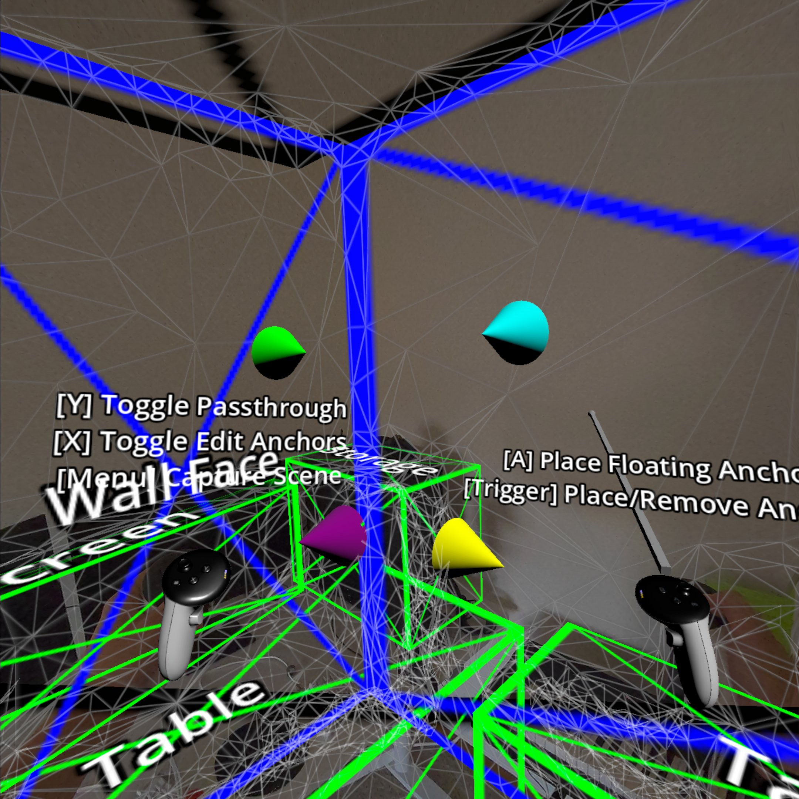

# Meta Scene Sample

> Note: this project requires Godot 4.3 or later

This is a sample project demonstrating the Meta scene and spatial anchor features supported by the Godot OpenXR Vendors plugin.
See the [Meta Scene Manager](https://godotvr.github.io/godot_openxr_vendors/manual/meta/scene_manager.html)
or [Meta Spatial Anchors](https://godotvr.github.io/godot_openxr_vendors/manual/meta/spatial_anchors.html)
tutorial docs for detailed walkthroughs of these features.

# Screenshots

